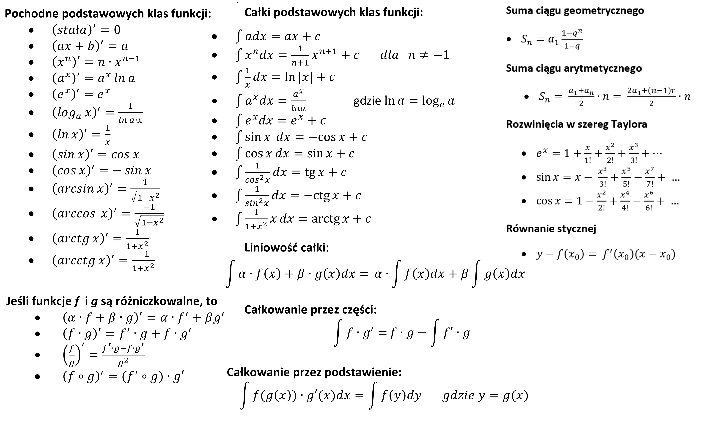

# Całki

Definiujemy całkę nieoznaczoną funkcji $f(x)$ jako funkcję pierwotną $F(x)$, czyli taką funkcję, że $F'(x)=f(x)$. Zapisujemy to w postaci

$$
\int f(x)\,dx=F(x)+C.
$$

Definiujemy całkę oznaczoną funkcji $f(x)$ na przedziale $[a,b]$ jako różnicę wartości funkcji pierwotnej w punktach $b$ i $a$, czyli

$$
\int_a^b f(x)\,dx=F(b)-F(a).
$$

## Wykład

- Materiały: <a href="../site_assets/calki.pdf">Całki.pdf</a>
- [Karta wzorów](../site_assets/karta_wzorow_v2.png)
- [Starsza prezentacja](../site_assets/calki_old.pdf)

## Wzory fundamentalne

---

* liniowość całki: $\displaystyle \int \bigl[\alpha f(x)+\beta g(x)\bigr] \, dx=\alpha\int f(x)\,dx+\beta\int g(x)\,dx$
* całkowanie przez części: $\displaystyle \int f\,dg=f\,g-\int g\,df$
* podstawienie, czyli zmiana zmiennej: $\displaystyle \int f\bigl(g(x)\bigr)g'(x)\,dx=\int f\bigl(g(x)\bigr)\,dg(x)=\int f(y)\,dy$

---

* podstawowe twierdzenie rachunku całkowego: $\displaystyle F'(x)=f(x)\implies \int_a^b f(x)\,dx=F(b)-F(a)$
* całkowanie odwraca różniczkowanie: $\displaystyle \int f'(z)\,dz=f(z)+C$
* różniczkowanie odwraca całkowanie: $\displaystyle \left(\int f(z)\,dz\right)'=f(z)$

---

* funkcja stała: $\displaystyle \int c\,dx=cx+C$
* funkcja potęgowa: $\displaystyle \int x^\alpha\,dx=\frac{x^{\alpha+1}}{\alpha+1}+C$, gdzie $\alpha\neq -1$
* funkcja odwrotna: $\displaystyle \int \frac{1}{x}\,dx=\ln\lvert x\rvert+C$
* funkcja wykładnicza: $\displaystyle \int e^x\,dx=e^x+C$
* sinus: $\displaystyle \int \sin x\,dx=-\cos x+C$
* cosinus: $\displaystyle \int \cos x\,dx=\sin x+C$

## Quiz

**1.** Załóżmy, że znasz prędkość $v(t)$ pewnego obiektu w każdej chwili $t$ oraz jego położenie w chwili $t=0$ i chcesz wyznaczyć jego położenie $s(t)$ w dowolnej chwili $t$. Czy skorzystasz z całek czy pochodnych?

**2.** Załóżmy, że znasz położenie $s(t)$ pewnego obiektu w każdej chwili $t$ i chcesz wyznaczyć jego prędkość $v(t)$ w dowolnej chwili $t$. Użyjesz całek czy pochodnych?

**3.** Niech $f(x)$ będzie pewną ciągłą i różniczkowalną funkcją. Uprość następujące całki:

- a) $\displaystyle \int df$,
- b) $\displaystyle \int \frac{df}{dx}\,dx$,
- c) $\displaystyle \int f'(x)\,dx$.

**4.** Ćwiczenie z terminologii: które z poniższych całek są nieoznaczone, które oznaczone, a które właściwe lub niewłaściwe?

- a) $\displaystyle \int_0^\infty e^{-x^2}\,dx$,
- b) $\displaystyle \int x^2\,dx$,
- c) $\displaystyle \int_0^z dx$,
- d) $\displaystyle \int \frac{1}{\sqrt{x}}\,dx$,
- e) $\displaystyle \int_2^4\frac{1}{\sqrt{x(x-1)}}\,dx$.

## Zadania do wykonania ręcznie

**Zadanie 1.** Oblicz ręcznie całki nieoznaczone — bezpośrednio, przez podstawienie lub przez części:

- a) $\displaystyle \int \left(\frac13x^4-5\right)\,dx$
- ą) $\displaystyle \int (\sin^2x+\cos^2x)\,dx$
- b) $\displaystyle \int (5\sin x+3e^x)\,dx$
- c) $\displaystyle \int \sqrt[3]{x}\,dx$
- ć) $\displaystyle \int \sqrt{10x}\,dx$
- d) $\displaystyle \int \frac{dx}{2x}$
- e) $\displaystyle \int (x^2+3x+5)\sqrt{x}\,dx$
- ę) $\displaystyle \int \frac{11x^5-12x^3+2x^2-1}{x}\,dx$
- f) $\displaystyle \int \frac{x^2-1}{x-1}\,dx$
- g) $\displaystyle \int (3-5x)\sqrt{x}\,dx$
- h) $\displaystyle \int \frac{x+2}{x+1}\,dx$
- i) $\displaystyle \int \frac{1}{2x+7}\,dx$
- j) $\displaystyle \int \frac{3x}{2x^2+5}\,dx$
- k) $\displaystyle \int x^2(1+x)^2\,dx$
- l) $\displaystyle \int x\sin(x^2)\,dx$
- ł) $\displaystyle \int (x+5)^{60}\,dx$
- m) $\displaystyle \int \cos\left(\frac52x+3\right)\,dx$
- n) $\displaystyle \int \frac{\cos(\ln x)}{x}\,dx$
- ń) $\displaystyle \int \sin(\sin x)\cos x\,dx$
- o) $\displaystyle \int x\sqrt{x^2-3}\,dx$
- ó) $\displaystyle \int \sqrt{5x+10}\,dx$
- p) $\displaystyle \int \frac{e^{1/x}}{x^2}\,dx$
- q) $\displaystyle \int (e^{x+1})^2\,dx$
- r) $\displaystyle \int x^2e^{x^3+1}\,dx$
- s) $\displaystyle \int 5^{2x}\,dx$, pamiętając, że $\displaystyle \int a^x\,dx=\frac{a^x}{\ln a}$
- ś) $\displaystyle \int e^x\sin x\,dx$
- t) $\displaystyle \int x^2e^x\,dx$
- u) $\displaystyle \int (x+7)\sin(x+3)\,dx$
- v) $\displaystyle \int x^2\ln x\,dx$
- w) $\displaystyle \int \sqrt{x}\ln x\,dx$
- x) $\displaystyle \int x\ln x\,dx$
- y) $\displaystyle \int \ln x\,dx$
- z) $\displaystyle \int \sin x\cos x\,dx$
- ź) $\displaystyle \int \sin^2x\,dx$

**Zadanie 2.** Oblicz ręcznie:

$$
\int_{-1}^{1}(-x^2+4)\,dx,
$$

$$
\int_1^e\frac{3}{x}\,dx,
$$

$$
\int_0^{\pi/2}\sin^2x\,dx.
$$

**Zadanie 3.** Oblicz ręcznie pole pod grzbietem sinusa,

$$
P=\int_0^\pi\sin x\,dx,
$$

oraz w Octave lub Wolfram Alpha długość krzywej sinusa na tym samym odcinku, korzystając ze wzoru

$$
L=\int_a^b\sqrt{1+[f'(x)]^2}\,dx,
$$

gdzie $f(x)=\sin x$.

**Zadanie 4.** Oblicz ręcznie pole figury ograniczonej krzywymi $y=e^x$, $y=e^{-x}$ oraz prostą $x=1$.

**Zadanie 5.** Oblicz pole obszaru ograniczonego liniami $x=1$, $x=2$, $y=0$ oraz $y=x^2+1$.

## Zadania do wykonania przy asyście komputera

**Zadanie 1.** Wyznacz na komputerze całki nieoznaczone, których rozwiązania nie są funkcjami elementarnymi:

- $\displaystyle \int x^2e^{-x^2}\,dx$,
- $\displaystyle \int \sqrt{t}\,e^{-t}\,dt$.

**Zadanie 2.** Policz na komputerze

$$
\int_0^\infty e^{-x^2}\,dx.
$$

**Zadanie 3.** Korzystając z Octave, wyznacz wartości całki Fresnela

$$
S(x)=\int_0^x\sin(t^2)\,dt
$$

dla $x=0$, $0.5$, $1$, $10$, $100$. Porównaj wyniki uzyskane w Octave z wynikami otrzymanymi w Wolfram Alpha.

**Zadanie 4.** Korzystając z Octave, wyznacz wartość całki

$$
\int_0^\infty\frac{\sin(t^2)}{t}\,dt.
$$

- a) Wypróbuj kilka metod Octave, np. `quad`, `quadl`, `quadv`, `quadgk` i `quadcc`.
- b) Porównaj wynik z tym, jaki podaje Wolfram Alpha.
- c) Sprawdź, jakie oszacowanie niepewności wartości całki zwraca ta metoda Octave, która zwraca jakikolwiek wynik.
