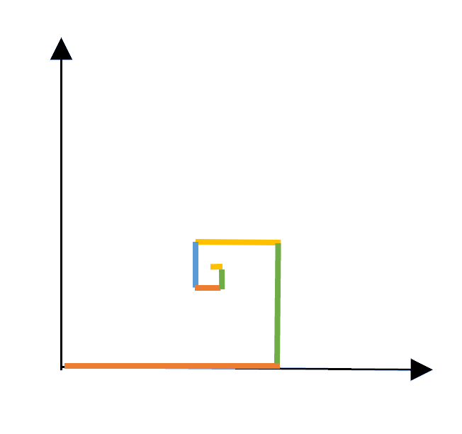

# Ciągi i szeregi

**Ciąg** $(a_n)$ to funkcja, która każdej liczbie naturalnej $n$ przyporządkowuje liczbę $a_n$. Możemy go zapisać jako $a_1,a_2,a_3,\ldots$ albo $\{a_n\}_{n=1}^{\infty}$. Liczby $a_n$ nazywamy wyrazami ciągu. **Szereg** jest wyrażeniem powstałym przez dodawanie wyrazów ciągu:

$$
a_1+a_2+a_3+\ldots.
$$

Jego $m$-tą sumą częściową nazywamy sumę pierwszych $m$ wyrazów:

$$
S_m=\sum_{n=1}^{m}a_n.
$$

Jeżeli ciąg sum częściowych $(S_m)$ ma skończoną granicę, to szereg $\sum_{n=1}^{\infty}a_n$ nazywamy zbieżnym, a tę granicę — jego sumą. W przeciwnym razie szereg jest rozbieżny.

## Wykład

- Materiały: <a href="../site_assets/ciagi.pdf">Ciągi.pdf</a>
<!-- - [Ciągi i szeregi — HTML](../site_assets/ciagi.html) -->
- [Starsza prezentacja](../site_assets/ciagi_old.pdf)

## Zadania do wykonania ręcznie — część A

**Zadanie 1.** Jaki to ciąg: $4,4,4,4,4,4,\ldots$?

**Zadanie 2.** Oblicz wartość piątego wyrazu ciągu arytmetycznego, jeżeli jego czwarty wyraz ma wartość 20, a szósty ma wartość 28.

**Zadanie 3.** Oblicz wartość ósmego wyrazu ciągu geometrycznego, którego siódmy wyraz ma wartość 9, a dziewiąty ma wartość 1.

**Zadanie 4.** Dla ciągu o wzorze ogólnym $a_n=2n-10$ określ, ile wyrazów ciągu przyjmuje wartość ujemną.

**Zadanie 5.** Podaj wzór rekurencyjny $a_{n+1}=a_n+\ldots$ ciągu arytmetycznego, którego pierwszy wyraz ma wartość 5, a dziesiąty wyraz ma wartość 23.

**Zadanie 6.** Oblicz sumę wyrazów ciągu geometrycznego: $-1+2-4+\ldots-64$.

**Zadanie 7.** Udowodnij, że $a_n=2n^2-1$ nie jest ciągiem arytmetycznym.

**Zadanie 8.** Ciąg arytmetyczny składa się z 200 elementów. Pierwszy z nich ma wartość $-10$, a wartością ostatniego jest 60. Ile wynosi suma tego ciągu?

**Zadanie 9.** Ile wynosi wyrażenie $1+2+4+8+\ldots+2^{10}$?

**Zadanie 10.** Dla jakich wartości parametru $n$ podany ciąg jest arytmetyczny: $(n^2-1)$, $(3n+1)$, $(2n^2-6)$?

**Zadanie 11.** Pomiędzy liczby 4 i 108 wstaw dwie liczby tak, by tworzyły ciąg geometryczny.

**Zadanie 12.** Udowodnij, że w ciągu arytmetycznym każdy wyraz $a_n$ jest średnią arytmetyczną swoich sąsiadów:

 $$
 a_n=\frac{a_{n-1}+a_{n+1}}{2}.
 $$

**Zadanie 13.** Udowodnij, że w ciągu geometrycznym każdy wyraz $a_n$ jest średnią geometryczną swoich sąsiadów:

 $$
 a_n^2=a_{n-1}\cdot a_{n+1}.
 $$

## Zadania przy asyście komputera

**Zadanie 1.** Do czego w Octave służą polecenia:

- `cumsum`,
- `diff`?

**Zadanie 2.** Używając Octave, wyznacz sumy skończone:

- $\displaystyle \sum_{k=1}^{100} k^2$,
- $\displaystyle \frac{4}{N}\sum_{k=1}^{N}\sqrt{1-\frac{k^2}{N^2}}$ dla $N=10000$.

Uwaga: powyższe wyrażenie z całkiem niezłą dokładnością przybliża pole koła o promieniu 1, czyli wartość $\pi$.

**Zadanie 3.** Znajdź w Wolfram Alpha następujące sumy nieskończone:

- $\displaystyle \sum_{k=0}^{\infty}\left(\frac{3}{4}\right)^k$ — wyjątkowo ten przykład najpierw zrób ręcznie,
- $\displaystyle \sum_{k=2}^{\infty}\frac{1}{k^2-1}$,
- $\displaystyle \sum_{k=2}^{\infty}\frac{1}{k^2-k-1}$,
- $\displaystyle \sum_{k=0}^{\infty}k\,a^{-k}$, $|a|>1$,
- $\displaystyle \sum_{k=0}^{\infty}\frac{2k+1}{(2k)!}$.

**Zadanie 4.** W pewnym eksperymencie dostaliśmy wartość $1.291285\ldots$. Sprawdź na stronie [OEIS](https://oeis.org/), czy za tym nie stoi coś bardziej fundamentalnego. Wskazówka: na stronie wpisz `1,2,9,1,2,8,5`.

**Zadanie 5.** Mamy ciąg $1,2,4,7,11,16,\ldots$, gdzie widzimy, że przyrosty są zadane kolejnymi liczbami naturalnymi. Używając strony [OEIS](https://oeis.org/), ustal, jaka jest postać $a_n$.

**Zadanie 6.** Ile wynosi suma szeregu

$$
1+\frac{1}{1!}+\frac{1}{2!}+\frac{1}{3!}+\frac{1}{4!}+\ldots\,?
$$

**Zadanie 7.** Wiemy, że szereg harmoniczny jest rozbieżny, więc od wartości jeden rośnie w sposób nieograniczony, choć dość powolnie. Ile wyrazów musimy zsumować, by dostać wartość 100?

**Zadanie 8.** Podaj wzór na całkowitą liczbę bloków potrzebnych do stworzenia piramidy o $n$ stopniach. Zacznij od narysowania, jak taka konstrukcja wygląda od góry — jeden blok na warstwie 4 bloków, które z kolei leżą na warstwie 9 bloków, a te na warstwie 16 bloków itd.

Napisz sześć kolejnych wartości dla kolejnych $n$, np.

$$
n=1,\quad S_1=1;
\qquad
n=2,\quad S_2=1+4=5;
\qquad
n=3,\quad S_3=1+4+9=14.
$$

Zastosuj metodę z wykładu wykorzystującą w Octave polecenie `diff`. Znajdź końcowe wyrażenie. *Podpowiedź:* będzie to wielomian trzeciego stopnia w $n$. Dopiero na sam koniec możesz sprawdzić swój wynik z tym uzyskanym w Wolfram Alpha lub [OEIS](https://oeis.org/).

**Uwaga:** sprawdzenie odpowiedzi wcześniej oznacza, że jesteś oszustem i dosięgnie Cię klątwa faraona.

**Zadanie 9.** Według pewnej legendy związanej z szachami pewien mędrzec miał poprosić króla o „skromną” nagrodę:

> „Połóż panie na pierwszym polu szachownicy jedno ziarno pszenicy (*grain of wheat*), na drugim dwa, na kolejnych cztery, osiem, szesnaście i tak do ostatniego 64. pola, za każdym razem podwajając ich liczbę.”

Ile to ziaren pszenicy? Zakładając utrzymanie światowych zbiorów pszenicy z zeszłego roku ($7{,}52\times10^{11}\,\mathrm{kg}$), ile czasu zajęłoby uzbieranie takiej ilości?

**Zadanie 10.** Mrówka siedząca w początku układu współrzędnych postanowiła pójść 1 metr w prawo, następnie $1/2$ metra w górę, następnie $1/3$ metra w lewo, $1/4$ metra w dół, $1/5$ metra w prawo itd. Do jakiego miejsca ostatecznie doszła? Podaj współrzędne końcowego punktu.

 { width="300" }

**Zadanie 11.** Poniższy program w Octave wyznacza kilka pierwszych elementów [ciągu Viète’a](https://en.wikipedia.org/wiki/Vi%C3%A8te's_formula), który jest zbieżny do $2/\pi$, i na tej podstawie wyświetla kolejne przybliżenia liczby $\pi$:

 ```octave
 N = 10;
 x = zeros(1, N);
 x(1) = sqrt(2);

 for i = 1:(N - 1)
   x(i + 1) = sqrt(2 + x(i));
   wynik = 2 * 2^i / prod(x(1:i));
   disp([i, wynik, pi - wynik]);
 endfor
 ```

 Uruchom ten program. Przy okazji zapamiętaj na przyszłość użycie komendy `disp`. Przy jakiej dokładności wyznaczenia liczby $\pi$ dokładność uzyskiwana w Octave zaczyna odbiegać od wyników?

**Zadanie 12.** Zazwyczaj przy ciągach pada pytanie wyłącznie o finalną granicę, jednak możemy również zapytać, jak osiągana jest ta granica, np. poprzez zachowanie się jak funkcja potęgowa, logarytmiczna, liniowa lub wykładnicza. Na wykładzie omawiany jest przykład ze zbieżnością

 $$
 \frac{\sin(1/n)}{1/n}.
 $$

 Program:

 ```octave
 n = 1:1000;
 y = abs(sin(1./n)./(1./n) - 1);

 plot(y, "+;lin-lin;");
 xlim([0, 20]);
 pause(2);

 semilogx(y, "+;log-lin;");
 pause(2);

 semilogy(y, "+;lin-log;");
 pause(2);

 loglog(y, "+;log-log;");
 pause(2);

 loglog(n, y, "+;log-log;", n, 1./n.^2, ";1/n^2;");
 pause(2);

 loglog(n, y, "+;log-log;", n, 1./n.^2/6, "r;1/6n^2;");
 ```

 Uruchom ten program i odpowiedz na pytania:

 - Do czego w Octave służą polecenia `semilogx`, `semilogy` i `loglog`?
 - Zmodyfikuj program tak, by można było za jego pomocą określić szybkość zbieżności ciągu $a_n=2^{1/n}$.
 - **Uwaga:** w przykładzie z wykładu zastosowano odjęcie 1, aby badać zbieżność do zera. To samo będzie konieczne w analizowanym przykładzie — zrealizuj więc odjęcie 1 od podanego ciągu.
 - Pamiętaj również o poniższym zestawieniu na temat szybkości zbieżności, gdzie za pomocą zwykłych wykresów można **szacować**, czy **wiodący czynnik** w jakiejś zależności ma charakter:

   * liniowy, $f(x) = ax + b$, `Lin-Lin`
   * logarytmiczny, $f(x) = a \log x + b$, `Log-Lin`
   * wykładniczy, $f(x) = b \cdot a^x$, `Lin-Log`
   * potęgowy, $f(x) = ax^b$. `Log-Log`

Wartości $a$ i $b$ można odczytać z parametrów linii prostej na wykresie danego rodzaju

## Zadania do wykonania ręcznie — część B

**Zadanie 1.** Ile wynosi granica ciągu:

- $\displaystyle a_n=\frac{n^3+2n^2+3n+4}{4-3n+2n^2-n^3}$?
- $\displaystyle a_n=\frac{1+\frac12+\frac14+\ldots+\frac{1}{2^n}}{1+3+5+\ldots+(2n-1)}$?
- $\displaystyle a_n=\frac{2^{n+1}+3^{2n-1}}{4^n+9^n}$?

**Zadanie 2.** Wyznacz granicę niewłaściwą

$$
\lim_{n\to\infty}\frac{n^n}{3^n}.
$$

**Zadanie 3.** Ustal, czemu równe są granice

$$
\lim_{n\to\infty}\left(1+\frac1n\right)^n,
\qquad
\lim_{n\to\infty}\left(1-\frac1n\right)^n,
\qquad
\lim_{n\to\infty}\left(1+\frac an\right)^n.
$$

**Zadanie 4.** Podaj przykład ciągu mającego granicę niewłaściwą.

**Zadanie 5.** W jakim przypadku znajomość granicy dwóch ciągów $a_n$ i $b_n$ nie wystarcza do stwierdzenia istnienia i ewentualnej wartości granicy ciągu $a_n/b_n$?

**Zadanie 6.** Czy granica ciągu o elementach wymiernych może być niewymierna?
