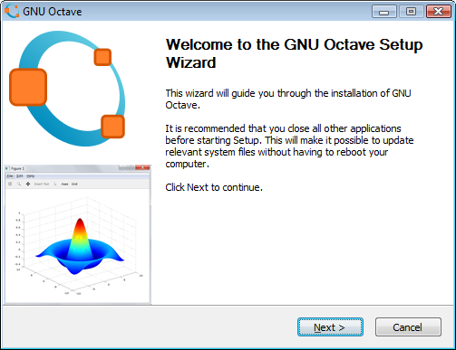

# Co to jest Octave/Oktawa?

GNU Octave jest podstawowym środowiskiem obliczeń numerycznych używanym w tej części kursu.

## Cechy programu Octave

**GNU Octave** jest programem oraz skryptowym językiem programowania przeznaczonym przede wszystkim do obliczeń numerycznych. Jest wolnym oprogramowaniem rozwijanym w ramach projektu GNU i udostępnianym na licencji GNU GPL. Działa m.in. w systemach GNU/Linux, Windows, macOS i BSD.

Octave udostępnia narzędzia m.in. do:

- obliczania wartości wyrażeń i funkcji matematycznych,
- pracy z liczbami zespolonymi,
- obliczania sum i iloczynów dużych zbiorów liczb,
- rozwiązywania układów równań liniowych,
- regresji i aproksymacji,
- rozwiązywania równań nieliniowych,
- obliczania całek oznaczonych,
- rozwiązywania równań różniczkowych zwyczajnych,
- rozwiązywania i numerycznej analizy wybranych równań różniczkowych cząstkowych,
- wykonywania standardowych obliczeń algebry liniowej,
- analizy danych,
- tworzenia wykresów 2D i 3D.

Octave jest także [skryptowym językiem programowania](https://pl.wikipedia.org/wiki/J%C4%99zyk_skryptowy), w którym można pisać własne programy i funkcje. Można go również rozszerzać o dynamicznie ładowane moduły napisane m.in. w C, C++ i Fortranie, co pozwala łączyć wygodę języka skryptowego z wysokowydajnym kodem kompilowanym.

Niniejszy kurs przedstawia elementarne wprowadzenie do posługiwania się Octave jako narzędziem do obliczeń numerycznych, programowania i wizualizacji danych.

Składnia GNU Octave jest w dużej mierze kompatybilna z MATLAB-em, ale w tym rozdziale traktujemy Octave jako samodzielne środowisko.

Octave można uruchamiać zarówno z **wiersza poleceń**, jak i w trybie **GUI**. Interfejs graficzny zawiera m.in. edytor kodu, debugger, przeglądarkę dokumentacji i konsolę interpretera, dzięki czemu program może pełnić rolę zintegrowanego środowiska pracy.

{ width="600" }

## Dokumentacja i instalacja

- [Strona projektu GNU Octave](https://octave.org/)
- [Pobieranie GNU Octave](https://octave.org/download)
- [Dokumentacja GNU Octave](https://docs.octave.org/)
- [Octave Wiki](https://wiki.octave.org/)
- [GNU Octave w Wikibooks](https://en.wikibooks.org/wiki/Octave_Programming_Tutorial)
- [Octave — podstawy (materiały dydaktyczne MIM UW)](http://dydmat.mimuw.edu.pl/matematyka-obliczeniowa/octave-podstawy)

## Praca bez instalacji

Jeżeli nie chcesz instalować programu lokalnie, możesz skorzystać z wersji działającej w przeglądarce:

[Octave Online](https://octave-online.net/){ .md-button .md-button--primary }

## Zadania

1. Uruchom GNU Octave lokalnie.
2. Dodaj do zakładek przeglądarki stronę kursu oraz dokumentację Octave.