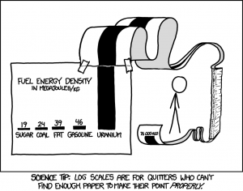
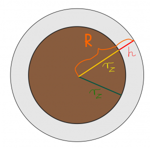

# Liczby i operacje

Ta część zbiera podstawowe pojęcia dotyczące zbiorów liczbowych, zapisu liczb, działań na zbiorach oraz liczb zespolonych. Jest pomyślana jako przygotowanie do dalszych rozdziałów o funkcjach, ciągach i analizie matematycznej.

## Wykład

- Materiały: [Liczby_i_operacje.pdf](../site_assets/Liczby_i_operacje.pdf)

## Zadania do wykonania ręcznie

### Zbiory liczbowe i zapis liczb

**Zadanie 1.** Dla każdej z liczb

$$
-7,\qquad 0,\qquad \frac34,\qquad \sqrt2,\qquad \pi,\qquad 1+i
$$

podaj najmniejszy spośród zbiorów $\mathbb N$, $\mathbb Z$, $\mathbb Q$, $\mathbb R$, $\mathbb C$, do którego dana liczba należy. W tym kursie przyjmujemy konwencję $\mathbb N=\{1,2,3,\ldots\}$, czyli $0\notin\mathbb N$.

**Zadanie 2.** Uporządkuj standardowe zbiory liczbowe przez inkluzję (co w czym się znajduje): $\mathbb N$, $\mathbb Z$, $\mathbb Q$, $\mathbb R$, $\mathbb C$.

**Zadanie 3.** Zamień rozwinięcie okresowe

$$
0.\overline{67}=0.676767\ldots
$$

na ułamek zwykły. 

**Zadanie 4.** Niech

$$
A=[-2,3],\qquad B=(1,5].
$$

Wyznacz zbiory $A\cap B$, $A\cup B$, $A\setminus B$ oraz $B\setminus A$ i zaznacz je na osi liczbowej.

### Liczby zespolone

Liczbą zespoloną nazywamy liczbę postaci $z=a+ib$, gdzie $a,b\in\mathbb R$, a $i$ jest jednostką urojoną spełniającą $i^2=-1$. Liczbę $a$ nazywamy częścią rzeczywistą, a $b$ — częścią urojoną liczby $z$.

**Zadanie 5.** Znając już liczby zespolone, znajdź ręcznie miejsca zerowe funkcji kwadratowej $y(x)=x^2+x+1$.

**Zadanie 6.** Dana jest liczba zespolona $z=1+i$. Zapisz ją w postaci trygonometrycznej.

**Zadanie 7.** Oblicz ręcznie $z^3$, gdzie $z=1+i$.

**Zadanie 8.** Dana jest liczba zespolona $z_1=3+4i$ oraz $z_2=1-2i$. Oblicz ręcznie iloraz $z_1/z_2$, podając wynik w postaci $a+ib$.

**Zadanie 9.** Sprawdź w Octave wartości `sqrt(2)`, `pi`, `eps` oraz `i^2`. Wyjaśnij, które z otrzymanych wartości są przechowywane dokładnie w używanej reprezentacji zmiennoprzecinkowej, a które jedynie w przybliżeniu. Zwróć uwagę, że `eps` nie jest stałą matematyczną taką jak $\pi$: w Octave oznacza odstęp między liczbą 1 a następną większą liczbą reprezentowalną w typie `double`.

**Zadanie 10.** Dla liczby zespolonej `z = 1 + 1*i` sprawdź w Octave polecenia `abs(z)`, `arg(z)`, `real(z)` i `imag(z)` i powiąż ich wyniki z postacią algebraiczną oraz trygonometryczną liczby zespolonej.

### Logarytmy i potęgi

**Zadanie 11.** Ile czasu musi upłynąć, by z pewnej masy $m$ izotopu o czasie połowicznego rozpadu 1000 lat pozostał tylko $1\%$ masy początkowej?

**Zadanie 12.** Zakładając $x>0$ oraz $y>0$, pokaż, że zachodzi

$
x^{\ln y}=y^{\ln x}.
$

Wskazówka: przyda Ci się wzór na zmianę podstawy logarytmu.

**Zadanie 13.** Stwierdzenie, ile cyfr ma liczba zapisana w postaci $10^{30}$, jest trywialnie proste. Policz ręcznie, ile w przybliżeniu cyfr ma liczba $2^{1000}$, jeśli wiadomo, że $\log_{10}(2)=0.30$. Na pewno przyda Ci się $b=a^{\log_a b}$.

**Zadanie 14.** Zajrzyj na stronę w angielskiej Wikipedii poświęconą [wykresom półlogarytmicznym](https://en.wikipedia.org/wiki/Semi-log_plot) (ang. *semi-log plots*) a następnie spójrz na poniższe obrazki

{ width="300" }

{ width="300" }

Odpowiedz: dlaczego do sporządzenia zamieszczonych obrazków użyto wykresu półlogarytmicznego typu lin-log? Wskaż, która oś ma skalę logarytmiczną** oraz **która przedstawiona wielkość zmienia się w szerokim zakresie wartości (obejmuje wiele rzędów wielkości).

## Zadania dodatkowe

**Zadanie A.** W książce R. Feynmana możemy przeczytać następujący fragment:

   > „Dawno temu, w erze paleozoicznej, kropla popołudniowej ulewy upadła na błotnistą równinę, pozostawiając trwały ślad. Ślad ten w postaci skamieliny odkopał pewnego upalnego dnia w wiele lat później student geologii. Wysączywszy do dna wodę ze swojej manierki student ten bezskutecznie się zastanawiał, ile cząsteczek wody z tej starożytnej kropli mogło znajdować się w manierce, którą przed chwilą opróżnił. Spróbuj Ty ocenić tę liczbę.”

   Zrób odpowiednie założenia potrzebne do rozwiązania zadania. Masa molowa wody wynosi $18,01528\,\mathrm{g/mol}$, a manierka niech ma pojemność 1 litra. Inne potrzebne dane znajdź w Wolfram Alpha lub wykorzystaj z pamięci, np. związek między liczbą moli, masą molową, liczbą Avogadra i liczbą cząstek. To zadanie nie jest żartem i da się je rozwiązać.

**Zadanie B.** Liczba cząsteczek gazu doskonałego w $1\,\mathrm{m}^3$ powietrza wynosi $2{,}69\times 10^{25}$ (zapis kalkulatorowy: `2.69e25`). Załóżmy, że każdą z tych cząsteczek nagle powiększyliśmy do rozmiarów ziarnka ryżu (*grain of rice*) i rozsypaliśmy równomiernie po powierzchni Ziemi, łącznie z oceanami. Oszacuj, jak grubą warstwą ryżu pokrylibyśmy naszą planetę.

   { width="300" }

