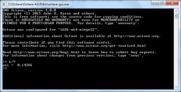
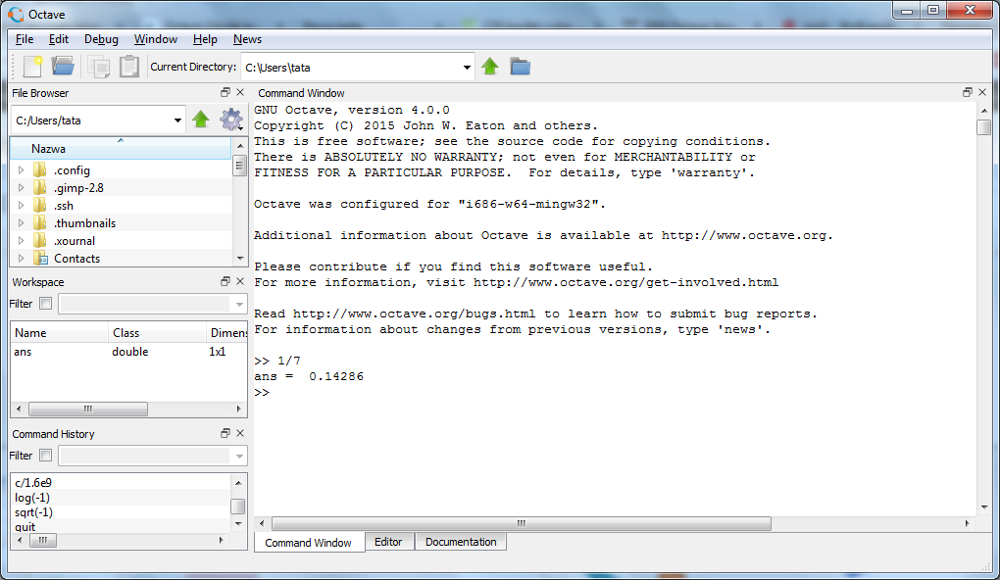

# Obsługa Octave’a

## Konsola i GUI

Octave może być używany zarówno z poziomu interfejsu graficznego, jak i z wiersza poleceń. W obu przypadkach podstawą pracy są te same polecenia tekstowe i ten sam język.

Dla użytkownika przyzwyczajonego do programów obsługiwanych głównie myszką praca w konsoli może początkowo wydawać się mniej wygodna. Jej podstawową zaletą, decydującą o przydatności programów konsolowych, jest jednak **łatwość automatyzacji**. Polecenia tekstowe można łatwo powtarzać, zapisywać w skryptach, uruchamiać wielokrotnie dla różnych danych, a także wywoływać z innych programów.

Dzięki temu to, co najpierw wykonujemy ręcznie w konsoli, może później stać się częścią większego procesu obliczeniowego. Konsola dobrze nadaje się więc do:

- powtarzalnych obliczeń,
- automatyzacji,
- szybkiego testowania pojedynczych poleceń,
- pracy na zdalnych komputerach,
- uruchamiania skryptów i procedur obliczeniowych.

Octave może pracować w dwóch podstawowych trybach: z linii komend, czyli jako **CLI** (*command-line interface*), oraz w wersji okienkowej, czyli **GUI** (*graphical user interface*). Interfejs graficzny korzysta z tego samego interpretera Octave i udostępnia dodatkowo m.in. edytor, przeglądarkę plików, podgląd zmiennych i historię poleceń.

W terminalu Octave można uruchomić poleceniem:

```text
octave
```

a interfejs graficzny, w instalacjach które go udostępniają, poleceniem:

```text
octave --gui
```

W systemach GNU/Linux terminal można zwykle otworzyć skrótem `Ctrl+Alt+T`.

{ width="420" }

*Przykład konsolowej wersji Octave.*

{ width="500" }

*Przykład Octave z interfejsem graficznym.*

## Historia poleceń

Klawisze `↑` i `↓` pozwalają przywoływać wcześniej wykonane polecenia. Jest to jeden z najwygodniejszych sposobów poprawiania i ponownego uruchamiania komend.

Mechanizm historii zwykle obejmuje również wcześniejsze sesje programu, dzięki czemu można wrócić do polecenia wykonanego wcześniej, poprawić je i uruchomić ponownie.

Polecenie:

```octave
history
```

wyświetla historię wykonanych instrukcji.

Jeżeli wynik jest wyświetlany przez pager, można spotkać sposób nawigacji znany z programu `less`:

- `f` — następny ekran,
- `b` — poprzedni ekran,
- `q` — wyjście.

## Tabulator i autouzupełnianie

Klawisz `Tab` uruchamia mechanizm automatycznego uzupełniania. Działa on nie tylko dla nazw funkcji, lecz również dla nazw zmiennych i plików.

Przykładowo po wpisaniu:

```text
roo
```

i naciśnięciu `Tab` Octave może uzupełnić nazwę funkcji `roots`.

Jeżeli początek nazwy nie jest jednoznaczny, pierwsze naciśnięcie `Tab` może nie wykonać pełnego uzupełnienia. Ponowne naciśnięcie wyświetla dostępne możliwości.

Autouzupełnianie jest szczególnie wygodne podczas pracy z plikami. Jeżeli w katalogu roboczym znajduje się np. plik:

```text
wyniki_pomiaru_2026.dat
```

to zamiast wpisywać całą nazwę można zacząć od kilku znaków i użyć `Tab`. Zmniejsza to liczbę literówek i ułatwia pracę z długimi nazwami plików.

Mechanizmu tego można używać także wewnątrz poleceń, np. przy wpisywaniu argumentu będącego nazwą pliku.

## Przydatne skróty klawiaturowe

- `↑`, `↓` — poprzednie i następne polecenia z historii,
- `Ctrl+R` — wyszukiwanie w historii poleceń,
- `←`, `→` — przesuwanie kursora,
- `Ctrl+K` — wycięcie tekstu od kursora do końca wiersza,
- `Ctrl+Y` — wklejenie tekstu z bufora,
- `Ctrl+G` lub `Esc` — wyjście z niektórych specjalnych trybów konsoli.

Warto szczególnie zapamiętać `Ctrl+R`: po jego naciśnięciu można zacząć wpisywać fragment dawnego polecenia zamiast wielokrotnie przeglądać historię klawiszem `↑`.

## Polecenia `help` i `doc`

Nie ma potrzeby zapamiętywania składni wszystkich funkcji Octave. Program ma rozbudowany system pomocy.

Polecenie:

```octave
help
```

wyświetla informacje o dostępnych poleceniach. Najczęściej podajemy jednak nazwę konkretnej funkcji:

```octave
help format
help roots
help plot
```

To najszybszy sposób, aby sprawdzić składnię i znaczenie argumentów funkcji podczas pracy w konsoli.

Pełniejsza dokumentacja jest dostępna przez:

```octave
doc operators
```

oraz analogicznie dla innych tematów i funkcji.

W zależności od sposobu uruchomienia Octave dokumentacja może zostać pokazana w oknie GUI albo w trybie tekstowym. W trybie tekstowym długie strony mogą korzystać z pagera. Wtedy przydatne są m.in. `PageDown`, `PageUp`, strzałki, `Home`, `End`, a do wyjścia zwykle służy `q`.

Internetowa wersja dokumentacji znajduje się na stronie [docs.octave.org](https://docs.octave.org/).


## Pliki pomocnicze

Octave korzysta m.in. z plików:

- `.octave_hist` — historia poleceń,
- `.octaverc` — instrukcje wykonywane podczas uruchamiania Octave.

Dokładna lokalizacja tych plików zależy od systemu operacyjnego i konfiguracji programu.

## Katalog roboczy

Podczas pracy ze skryptami i plikami danych trzeba kontrolować katalog roboczy. Najważniejsze polecenia to:

- `pwd` — wyświetla bieżący katalog,
- `ls` — wyświetla zawartość katalogu,
- `cd` — zmienia katalog roboczy.

Przykład:

```octave
pwd
cd octave
pwd
ls
```

Jeżeli skrypt `programik.m` znajduje się w katalogu roboczym, Octave może go uruchomić po wpisaniu samej nazwy:

```octave
programik
```

W wersji graficznej analogiczną rolę pełni m.in. panel *File Browser*. Warto zawsze sprawdzić, czy wskazuje katalog, w którym znajdują się używane skrypty i dane.

## Zadania

**Zadanie 1.** Uruchom Octave i wykonaj kolejno polecenia `2+2`, `sin(pi/2)` oraz `pwd`. Sprawdź otrzymane wyniki.

**Zadanie 2.** Za pomocą `↑` i `↓` wróć do wcześniejszych poleceń i zmodyfikuj jedno z nich.

**Zadanie 3.** Użyj `Ctrl+R`, aby odnaleźć wcześniejsze polecenie po fragmencie tekstu.

**Zadanie 4.** Użyj `Tab`, aby uzupełnić nazwę funkcji `roots` lub `plot`.

**Zadanie 5.** Utwórz plik o długiej nazwie i sprawdź autouzupełnianie jego nazwy za pomocą `Tab`.

**Zadanie 6.** Wyświetl pomoc dla poleceń `format`, `plot` i `roots`.

**Zadanie 7.** Sprawdź bieżący katalog poleceniem `pwd` i jego zawartość poleceniem `ls`.

**Zadanie 8.** Utwórz katalog roboczy dla kursu i przejdź do niego za pomocą `cd`.
