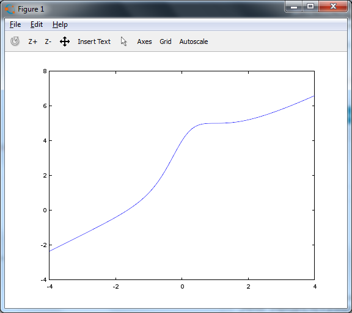
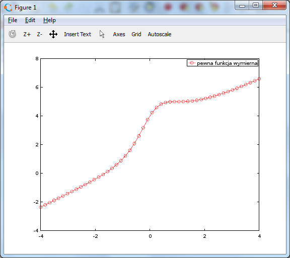
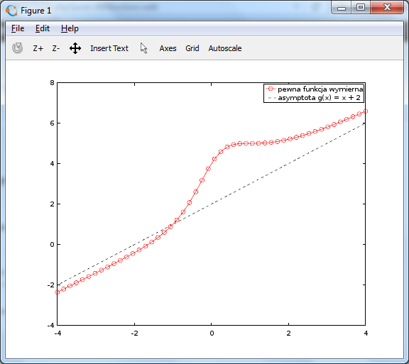
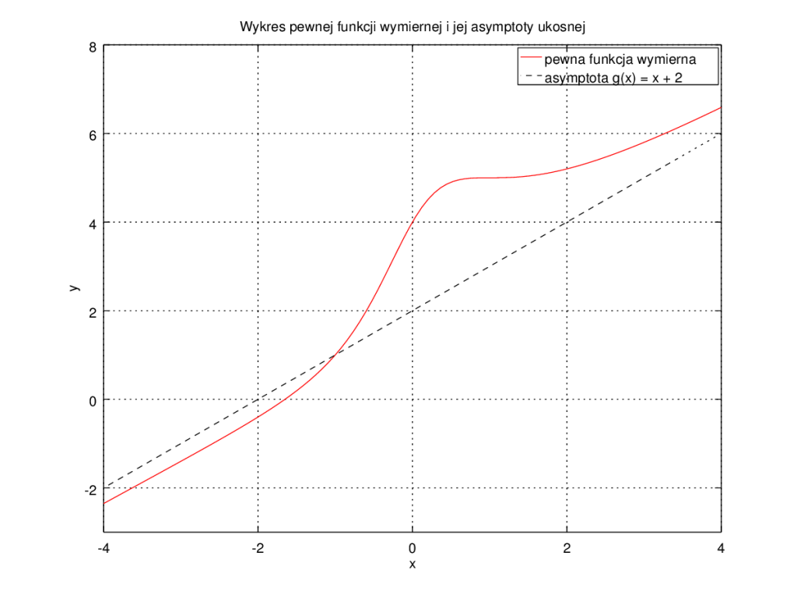
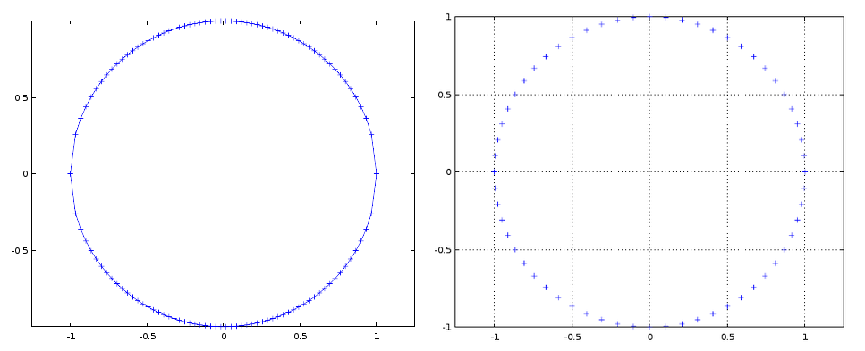

# Octave — wykresy

## Wykresy dwuwymiarowe

Aby narysować wykres funkcji jednej zmiennej, przygotuj wektor argumentów i odpowiadający mu wektor wartości, a następnie użyj `plot`:

```octave
x = -4:0.1:4;
y = (x.^3 + 2*x.^2 + 3*x + 4)./(x.^2 + 1);
plot(x, y);
```

Powyższy kod rysuje funkcję

$$
f(x)=\frac{x^3+2x^2+3x+4}{x^2+1}.
$$

{ width="600" }

## Inny sposób

Funkcja `linspace(a,b,N)` tworzy $N$ równomiernie rozmieszczonych punktów od $a$ do $b$:

```octave
x = linspace(-4, 4, 50);
y = (x.^3 + 2*x.^2 + 3*x + 4)./(x.^2 + 1);
plot(x, y, "ro-");
```

To wygodny sposób kontrolowania liczby punktów używanych do rysowania wykresu.

{ width="600" }

## Styl linii i punktów

Trzeci argument `plot` może określać sposób rysowania danych.

### Styl linii

- `-` — linia ciągła,
- `--` — linia przerywana,
- `:` — linia kropkowana,
- `-.` — linia kreska–kropka.

### Markery punktów

- `+` — plus,
- `o` — kółko,
- `*` — gwiazdka,
- `.` — punkt,
- `x` — krzyżyk,
- `s` — kwadrat,
- `d` — romb,
- `^`, `v`, `>`, `<` — trójkąty,
- `p` — pentagram,
- `h` — hexagram.

### Kolory

- `k` — czarny,
- `r` — czerwony,
- `g` — zielony,
- `b` — niebieski,
- `m` — magenta,
- `c` — cyan,
- `w` — biały.

Przykład dwóch wykresów na jednym rysunku:

```octave
x = linspace(-4, 4, 50);
y = (x.^3 + 2*x.^2 + 3*x + 4)./(x.^2 + 1);
y2 = x + 2;

plot(x, y, "ro-", x, y2, "k--");
legend("funkcja wymierna", "asymptota");
```

{ width="600" }

## Opisy osi, tytuł i zakres

Wykres można uzupełnić o opisy i siatkę:

```octave
x = linspace(-4, 4, 100);
y = (x.^3 + 2*x.^2 + 3*x + 4)./(x.^2 + 1);
y2 = x + 2;

plot(x, y, "r-", x, y2, "k--");
legend("funkcja wymierna", "asymptota");
xlabel("x");
ylabel("y");
title("Funkcja wymierna i jej asymptota");
ylim([-3, 8]);
grid on;
```

Najczęściej używane funkcje modyfikujące wykres to m.in.:

- `xlabel`, `ylabel` — opisy osi,
- `title` — tytuł,
- `legend` — legenda,
- `xlim`, `ylim` — zakres osi,
- `grid on` — siatka,
- `axis("square")` — kwadratowy obszar wykresu,
- `axis("equal")` — jednakowa skala jednostek na osiach.

{ width="600" }

## Zapisywanie wykresu

Wykres można zapisać do pliku, np.:

```octave
print "rys.png"
print "rys.eps"
```

Octave dobrze nadaje się do szybkiego generowania wykresów naukowych, również bez ręcznego korzystania z edytora graficznego.

## Wykres parametryczny — okrąg

Kod:

```octave
N = 60;
f = @(x) sqrt(1 - x.*x);
x = linspace(-1, 1, N);
x0 = linspace(1, -1, N);
y = [f(x), -f(x0)];
x = [x, x0];
plot(x, y, "+-");
axis("equal");
```

rysuje okrąg poprzez sklejenie dwóch wykresów funkcji. Punkty nie są jednak rozłożone równomiernie względem kąta.

{ width="600" }

Lepszym sposobem jest parametryzacja:

$$
x=\cos\varphi,
\qquad
y=\sin\varphi.
$$

Przykład:

```octave
phi = linspace(0, 2*pi, 100);
x = cos(phi);
y = sin(phi);
plot(x, y, "+-");
axis equal;
```

Ten przykład pokazuje, że `plot` nie ogranicza nas do wykresów typu $y=f(x)$ — można rysować także krzywe parametryczne.

## Narzędzia alternatywne

Do wizualizacji danych i przygotowywania rysunków przydatne są również m.in.:

- [Gnuplot](https://gnuplot.info/) — wykresy naukowe,
- Python z biblioteką Matplotlib — analiza danych i wykresy,
- arkusze kalkulacyjne — szybka analiza prostych zestawów danych,
- [Inkscape](https://inkscape.org/) — grafika wektorowa,
- [GIMP](https://www.gimp.org/) — grafika rastrowa,
- [ParaView](https://www.paraview.org/) — wizualizacja danych 2D/3D,
- Mathematica — zaawansowana wizualizacja i obliczenia symboliczne,
- TikZ/PGF — grafika tworzona bezpośrednio w LaTeX-u.

## Zadania

1. Napisz program generujący wykres

   $$
   f(x)=\sqrt{1-x^2},
   \qquad -1\le x\le1,
   $$

   wraz z tytułem i opisami osi.

2. Na podstawie poprzedniego zadania narysuj cały okrąg, sklejając dwie gałęzie funkcji. Wyświetlone „spłaszczone koło” popraw poleceniem używanym w pierwotnej wersji tego ćwiczenia:

   ```octave
   axis("square");
   ```

3. Zmieniając zakres argumentów i wartości, narysuj tylko prawą górną ćwiartkę okręgu.
4. Zapisz wykres okręgu do pliku PNG.
5. Porównaj metodę sklejania dwóch funkcji z parametryzacją przez kąt ($\varphi$). Która metoda daje bardziej równomierne rozmieszczenie punktów?
6. Narysuj wykresy kilku funkcji na jednym rysunku i dodaj legendę.
7. Sprawdź działanie `xlim`, `ylim`, `axis("square")`, `axis("equal")` i `grid on`. Porównaj różnicę między `square` i `equal`.
