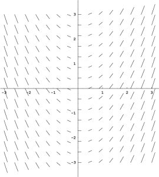
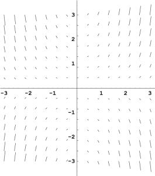
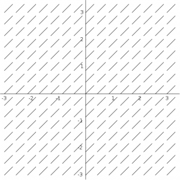

# ODE

ODE (ang. *ordinary differential equations*) to angielski skrótowiec oznaczający **równania różniczkowe zwyczajne**.

Są to równania, w których występują funkcje jednej zmiennej niezależnej oraz jej pochodne, czyli mamy do czynienia z równaniami postaci

$$
F\left(x,y(x),y'(x),y''(x),\ldots,y^{(n)}(x)\right)=0,
$$

gdzie $y(x)$ jest funkcją zmiennej $x$, a $\frac{dy}{dx}=y'(x),\frac{d^2y}{dx^2},\ldots,\frac{d^ny}{dx^n}$ są jej pochodnymi kolejnych rzędów.

W fizyce często używamy czasu $t$ jako zmiennej niezależnej, a funkcja $x(t)$ może oznaczać np. położenie ciała w funkcji czasu. Wtedy równanie różniczkowe zwyczajne przyjmuje postać

$$
F\left(t,x(t),\frac{dx}{dt},\frac{d^2x}{dt^2},\ldots,\frac{d^nx}{dt^n}\right)=0.
$$

gdzie $\frac{dx}{dt}=\dot{x},\frac{d^2x}{dt^2}=\ddot{x},\ldots,\frac{d^nx}{dt^n}$ są pochodnymi kolejnych rzędów funkcji $x(t)$ względem czasu $t$.

## Wykład

- Materiały: [ODE.pdf](../site_assets/ODE.pdf)
- Klasyfikacja: [równania liniowe](https://en.wikipedia.org/wiki/List_of_linear_ordinary_differential_equations) i [równania nieliniowe](https://en.wikipedia.org/wiki/List_of_nonlinear_ordinary_differential_equations)
- [Starsza prezentacja](../site_assets/ODE_old.pdf)

## Zadania do wykonania ręcznie

**A. Jaki jest rząd następujących równań różniczkowych zwyczajnych?**

1. $\displaystyle \frac{dx}{dt}=x^2$
2. $\displaystyle \left(\frac{dx}{dt}\right)^2=x$
3. $\displaystyle \frac{d^2x}{dt^2}=\left(\frac{dx}{dt}\right)^3$
4. $\displaystyle x+\frac{dx}{dt}\frac{d^2x}{dt^2}=0$

**B. Rozwiąż równania różniczkowe pierwszego rzędu metodą rozdzielania zmiennych:**

- a) $\displaystyle \frac{dy}{dx}=\frac{x}{y}$
- b) $\displaystyle \frac{dy}{dx}=\frac{y}{x}$
- c) $\displaystyle \frac{dy}{dx}=\frac{1}{x}$
- d) $\displaystyle \frac{dy}{dx}=xy$
- e) $\displaystyle \frac{dy}{dx}=\sqrt{x}$
- f) $\displaystyle y\,dx+x\,dy=0$

**C. Rozwiąż równania różniczkowe drugiego rzędu:**

- a) $\displaystyle \frac{d^2x}{dt^2}-a=0$
- b) $\displaystyle \frac{d^2y}{dx^2}-\frac{dy}{dx}=0$
- c) $y''+y'=0$, przy warunkach $y(0)=2$ oraz $y'(0)=-1$
- d) $y''-y=0$, przy warunkach $y(0)=2$ oraz $y'(0)=0$
- e) $y''-4y'+4y=0$, przy warunkach $y(0)=1$ oraz $y'(0)=1$
- f) $\displaystyle \frac{d^2y}{dx^2}=\omega^2y$
- g) $\displaystyle \frac{d^2y}{dx^2}=-\omega^2y$

## Dodatkowe zadania

**Zadanie 1.** Zmiana prędkości pewnego samochodu od momentu wyłączenia silnika do chwili, w której samochód się zatrzymuje, opisana jest równaniem

$$
\frac{dv}{dt}=-(b+cv^2),
$$

gdzie $v$ jest prędkością samochodu w metrach na sekundę, a $t$ — czasem wyrażonym w sekundach. Aby jednostki w równaniu były zgodne, parametr $b$ ma jednostkę $\mathrm{m/s^2}$, natomiast $c$ — $\mathrm{m^{-1}}$. Parametry te opisują odpowiednio składnik oporu niezależny od prędkości oraz składnik proporcjonalny do $v^2$.

- Znajdź funkcję $v(t)$ w Wolfram Alpha, przyjmując $b=0.12$ oraz $c=2.4\times10^{-4}$.
- Zakładając prędkość początkową $100\,\mathrm{km/h}$, znajdź drogę, po której samochód się zatrzyma.
- O ile zmieniłaby się droga do zatrzymania samochodu, gdyby zaniedbać opór powietrza, czyli przyjąć $c=0$?

**Zadanie 2.** Przyporządkuj poniższe pola kierunków odpowiednim równaniom.

{ width="260" }

{ width="260" }

{ width="260" }

- $\displaystyle \frac{dx}{dt}=1$
- $\displaystyle \frac{dx}{dt}=t$
- $\displaystyle \frac{dx}{dt}=tx$

**Zadanie 3.** Zapoznaj się z [symulacją on-line atraktora Lorenza](http://www.malinc.se/m/Lorenz.php).

- Poeksperymentuj z parametrami układu równań.
- Jaki efekt ilustruje symulacja „niebieskich motyli” w „małym pudełku” (*small cube*)?
- Jaki efekt ilustruje symulacja „niebieskich motyli” w „dużym pudełku” (*large cube*)?

**Zadanie 4.** Rozwiąż równania Lorenza

$$
\begin{aligned}
\frac{dx}{dt} &= -\sigma x+\sigma y,\\
\frac{dy}{dt} &= -xz+rx-y,\\
\frac{dz}{dt} &= xy-bz,
\end{aligned}
$$

dla parametrów $\sigma=10$, $r=28$, $b=2.5$, z dowolnym warunkiem początkowym, np. takim, dla którego $-50\le x,y,z\le50$.

Skopiuj do swojego katalogu roboczego plik `lorenz.m`:

```octave
function dx = lorenz(xx, t)
  dx = zeros(3, 1);  # rezerwacja miejsca
  global sigma;
  global r;
  global b;

  x = xx(1);  # ułatwienie zapisu
  y = xx(2);
  z = xx(3);

  dx(1) = ...  # uzupełnij
  dx(2) = ...  # uzupełnij
  dx(3) = ...  # uzupełnij
endfunction
```

Uzupełnij definicję funkcji `lorenz` — trzy wykropkowane instrukcje — zgodnie z układem równań różniczkowych.

Następnie utwórz plik `make_lorenz.m`:

```octave
global sigma;
global r;
global b;

sigma = ...;  # uzupełnij
r = ...;      # uzupełnij
b = ...;      # uzupełnij

x0 = ...;  # uzupełnij
y0 = ...;  # uzupełnij
z0 = ...;  # uzupełnij

N = 40000;
t = linspace(0, 40, N);
sol = lsode("lorenz", [x0, y0, z0], t);

plot3(sol(1:N, 1), sol(1:N, 2), sol(1:N, 3), "r", "linewidth", 2);
xlabel("x", "fontsize", 15);
ylabel("y", "fontsize", 15);
zlabel("z", "fontsize", 15);
set(gca, "fontsize", 16);
```

Uzupełnij wartości parametrów równania $(\sigma,r,b)$ oraz warunku początkowego $(x_0,y_0,z_0)$ i uruchom skrypt. Porównaj kształt rozwiązania z tym, jak generuje je program z poprzedniego zadania.

- Wygeneruj rozwiązania dla dwóch zupełnie różnych warunków początkowych, np. $(1,1,1)$ i $(20,-20,10)$. Czy oba zbiegają do tego samego *atraktora*?
- Wygeneruj rozwiązania dla dwóch bardzo bliskich warunków początkowych $(x_0,y_0,z_0)$, np. $(1,1,1)$ oraz $(1,1,1.000001)$.
- Zbadaj różnicę między oboma rozwiązaniami w funkcji czasu, np. instrukcją:

```octave
plot(t, sol(:, 1) - sol2(:, 1));
```

- Następnie użyj wykresu półlogarytmicznego:

```octave
semilogy(t, abs(sol(:, 1) - sol2(:, 1)));
```
