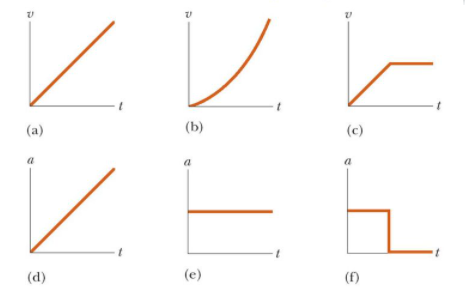
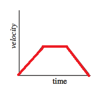
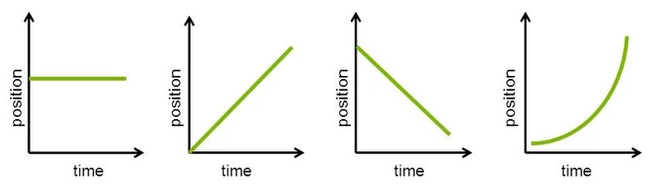
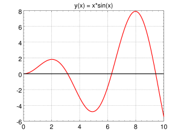
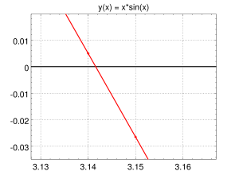
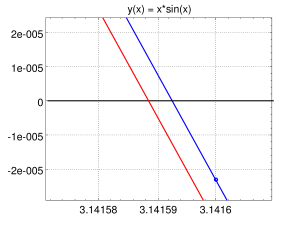
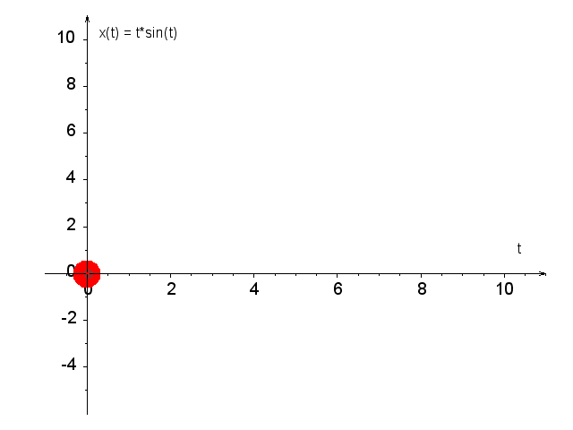
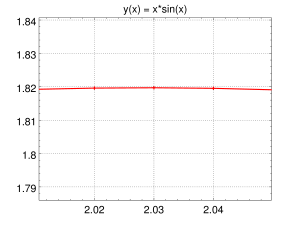
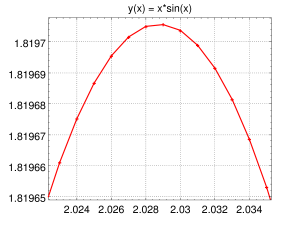
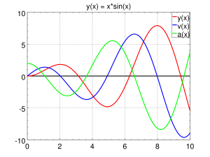

# Pochodna (2)

Druga część materiału o pochodnych.

## Wykład

- Materiały: [Pochodne2.pdf](../site_assets/Pochodne2.pdf)
- [Karta wzorów](../site_assets/karta_wzorow_v2.png)
- [Starsza prezentacja](../site_assets/pochodne2_old.pdf)

<!-- [Pochodne — notatki SVG](../site_assets/Pochodne-2.svg) komentarz: nie działa w przeglądarce, bo SVG nie jest osadzone w HTML -->

## Zadania do wykonania ręcznie

**Zadanie 1.** Powiąż wykresy prędkości z wykresami przyspieszeń:

{ width="600" }

**Zadanie 2.** Narysuj wykres położenia od czasu i przyspieszenia od czasu:

{ width="500" }

**Zadanie 3.** Narysuj wykresy prędkości od czasu i przyspieszenia od czasu:

{ width="600" }

**Zadanie 4.** Narysuj wykres położenia od czasu, wiedząc, że:

{ width="600" }

**Zadanie 5.** Narysuj wykres prędkości od czasu, wiedząc, że:

{ width="600" }

**Zadanie 6.** Jeżeli małpka na sprężynie porusza się wzdłuż jednej prostej, np. w kierunku góra–dół, to w punktach maksymalnego wychylenia jej prędkość znika. Jak ta obserwacja ma się do sposobu ustalania ekstremów funkcji za pomocą pochodnych?

{ width="150" }

**Zadanie 7.** Rozpatrzmy funkcję

$$
y(x)=\sqrt{1+x}.
$$

- Znajdź równanie prostej, która aproksymuje tę funkcję w pobliżu punktu $x=0$.
- Uzasadnij, że dla dostatecznie małych $x$ wartość $\sqrt{1+x}$ można przybliżyć wyrażeniem $1+x/2$. Uwaga: jest to tak często używane przybliżenie, że warto je zapamiętać.
- Oszacuj w pamięci wartości $\sqrt{1.02}$ oraz $\sqrt{0.96}$.

**Zadanie 8.** Rozwiń funkcję $\sin x$ w szereg Taylora w punkcie $x_0=\pi$.

**Zadanie 9.** Rozwiń funkcję $\sin x$ w szereg Taylora w punkcie $x_0=3\pi/2$.

**Zadanie 10.** Policz pochodną $e^{ax}$ z definicji ilorazu różnicowego. Wskazówka: w którymś momencie musisz użyć rozwinięcia $e^{ax}$ w szereg Taylora.

**Zadanie 11.** Policz styczną w punkcie $x_0=1$:

- funkcji $1/x$,
- funkcji $x\sin(x^2)$.

**Zadanie 12.** Niech $y=k\sin(ax)$. Oblicz:

- $\dfrac{dy}{dx}$,
- $\dfrac{dy}{da}$,
- $\dfrac{dy}{dk}$.

**Zadanie 13.** Podaj różniczki następujących funkcji jednej zmiennej:

- $y(x)=\sin(2x)$,
- $y(x)=\ln(3x)$,
- $y(t)=4e^{-3t}$,
- $y(t)=gt^2/2+v_0t$,
- $x(t)=\sin(at)e^{-\omega t}$.

**Zadanie 14.** Podaj różniczki następujących funkcji dwóch zmiennych. Pamiętaj, że w takim przypadku wzór na różniczkę zawiera pochodne cząstkowe:

- $\psi(t,x)=\sin(kx)e^{-\omega t}$,
- $f(x,y)=x/y$.

**Zadanie 15.** Pomiar średnicy pewnego koła dał wartość $L=31.0\pm0.5\,\mathrm{cm}$. Na tej podstawie oszacowano, że obwód tego koła wynosi $O=\pi L\approx97.4\,\mathrm{cm}$, a jego pole

$$
P=\frac{\pi L^2}{4}\approx754.8\,\mathrm{cm}^2.
$$

Oszacuj niepewność pomiaru:

- długości obwodu tego koła, $\Delta O$,
- pola powierzchni tego koła, $\Delta P$.

**Zadanie 16.** Gdyby średnica koła wzrosła 2 razy, to jego obwód również wzrósłby 2 razy, natomiast pole jego powierzchni powiększyłoby się 4 razy. Przypuśćmy, że niepewność pomiarową długości średnicy koła uda się zredukować o 50%. Jak wpłynie to na zmianę niepewności pomiarowej:

- obwodu koła, $\Delta O$?
- pola powierzchni koła, $\Delta P$?

**Zadanie 17.** Korzystając z prawa Ohma, $R=U/I$, wyznacz opór elektryczny $R$ i oszacuj błąd pomiaru tej wielkości, jeżeli $U=10.00\,\mathrm{V}$, $\Delta U=0.10\,\mathrm{V}$, $I=5.00\,\mathrm{A}$, a $\Delta I=0.05\,\mathrm{A}$.

## Zadania do wykonania przy asyście komputera

**Zadanie 1.** Wyznacz komputerowo ekstremum funkcji:

- $x^x$,
- $x^{-x}$,
- $x^3-3x^2+4$,
- $e^x-2x^2$.

**Zadanie 2.** Przeanalizuj poniższy kod rysujący funkcję i jej pochodną. Wybierz następnie inną, bardziej skomplikowaną funkcję. Sprawdź na wykresie, gdzie pochodna się zeruje, a następnie ustal, czy otrzymany punkt stacjonarny jest minimum, maksimum czy nie jest ekstremum. Punktów przegięcia nie należy utożsamiać z zerami pierwszej pochodnej — ich występowanie wiąże się ze zmianą wypukłości funkcji i można je badać m.in. za pomocą drugiej pochodnej.

```octave
% Define the function and numerical derivative
f = @(x) x.^2; % Function
numerical_derivative = @(f, x, dx) (f(x + dx) - f(x)) ./ dx; % Numerical derivative

% Parameters
dx = 0.0001; % Small step size
x_values = linspace(-10, 10, 500); % Generate x values
f_values = f(x_values); % Calculate function values
derivative_values = numerical_derivative(f, x_values, dx); % Calculate derivative values

% Plot the function and its derivative
figure;
hold on;

% Plot f(x)
plot(x_values, f_values, 'b-', 'LineWidth', 2, 'DisplayName', 'f(x) = x^2');

% Plot f'(x)
plot(x_values, derivative_values, 'r--', 'LineWidth', 2, 'DisplayName', 'f''(x) = 2x');

% Labels and Legend
title('Function and its Derivative', 'FontSize', 16);
xlabel('x', 'FontSize', 14);
ylabel('y', 'FontSize', 14);
legend('show', 'Location', 'northwest');

% Ensure the same ratio of axes
axis equal;
grid on;

hold off;
```

**Zadanie 3.** Zbadaj właściwości funkcji

$$
x(t)=t\sin t,
$$

dla $0\le t\le10$. Zadanie jest ćwiczeniem na rysowanie wykresów w Octave i korzystanie z funkcji `fzero`.

**Plan działania**

**Krok 1.** Zrób wykres tej funkcji dla $0\le t\le10$. Aby uzyskać czytelny wykres, możesz użyć następującego ciągu instrukcji:

```octave
N = 1001;
tmax = 10;
t = linspace(0, tmax, N);
x = @(t) (t .* sin(t));
# v = @(t) (...);   # <-- odkomentuj i uzupełnij później
# a = @(t) (...);   # <-- odkomentuj i uzupełnij później
fig = plot(t, x(t), "-r", t, 0*t, "-k");
ax = gca();      # uchwyt do opisu osi
leg = legend();  # uchwyt do legendy wykresu
set(ax, "fontsize", 20);
set(ax, "xminortick", "on");
set(ax, "yminortick", "on");
set(leg, "fontsize", 20);
set(fig, "linewidth", 2);
title("x(t) = t*sin(t)");
grid on;
```

Przykładowy wynik:

{ width="300" }

**Krok 2.** Na podstawie wykresu oszacuj, ile ta funkcja ma miejsc zerowych, maksimów, minimów i punktów przegięcia na przedziale $0\le t\le10$.

**Krok 3.** Na podstawie wykresu oszacuj, dla jakich wartości $t$ funkcja $x(t)$ jest rosnąca, malejąca, wklęsła i wypukła.

**Krok 4.** Miejsca zerowe uzyskujemy z rozwiązania równania $t\sin t=0$, czyli $t=0$ lub $\sin t=0$, a więc $t=0,\pi,2\pi,3\pi$.

**Krok 5.** Czy miejsca zerowe można łatwo odczytać z wykresu? W instrukcji `plot` dodaj parametr `+`:

```octave
fig = plot(t, x(t), "-+r", t, 0*t, "-k");
```

Powiększ wykres wokół drugiego miejsca zerowego, czyli $\pi$. Należy zauważyć, że Octave rysuje wykres z odcinków łączących kolejne punkty, jest więc przybliżoną reprezentacją rzeczywistej krzywej. Jeśli kolejne wartości argumentu $t$ użyte do rysowania wykresu są oddalone od siebie o $0.01$, oszacuj dokładność takiej aproksymacji. Można oczekiwać, że błąd interpolacji pomiędzy sąsiednimi punktami jest rzędu $h^2$, gdzie $h$ to połowa odległości między kolejnymi wartościami argumentu. W naszym przypadku $h^2=0.000025$.

{ width="300" }

{ width="300" }

{ width="300" }

Skrypt: [`anim.txt`](../site_assets/anim.txt) użyty do przygotowania animacji.

**Krok 6.** Położenia miejsc zerowych dowolnej funkcji można wyznaczyć w Octave za pomocą `fzero`:

```text
>> fzero(x, 3)
ans = 3.14159265358980
```

Pierwszym argumentem jest funkcja, a drugim przybliżona wartość poszukiwanego miejsca zerowego. Za pomocą tej funkcji znajdź kolejne miejsca zerowe funkcji $x(t)=t\sin t$ w przedziale $0\le t\le10$ i sprawdź, że rzeczywiście są równe $0$, $\pi$, $2\pi$ i $3\pi$.

**Krok 7.** Skoro znamy już punkty zerowe funkcji $x(t)$, czas na wyznaczenie ekstremów. Najprostsze podejście polega na powiększaniu wykresu w okolicach punktu, w którym spodziewamy się występowania minimum lub maksimum. Zwiększ następnie liczbę punktów siatki:

```octave
N = 10001;
```

Sprawdź, jak zmienia się oszacowanie położenia maksimum. Zmianie argumentu $\Delta t=0.001$ odpowiada w pobliżu ekstremum znacznie mniejsza zmiana wartości położenia $\Delta x$, rzędu $(\Delta t)^2$. Wykonaj podobną analizę dla drugiego maksimum lub pierwszego minimum.

{ width="300" }

{ width="300" }

**Krok 8.** Zamiast szukać maksimum lub minimum bezpośrednio, znajdź miejsca zerowe pochodnej funkcji $x(t)$. Zdefiniuj funkcję $v(t)$ jako pochodną $x(t)$:

```octave
v = @(t) (...);
```

Trzy kropki zastąp odpowiednią definicją.

**Krok 9.** Wykonaj rysunek $x(t)$ i $v(t)$.

**Krok 10.** Wyznacz wszystkie punkty zerowe funkcji $v(t)$ za pomocą `fzero`. Zapisz ich wartości.

**Krok 11.** Dokładność wyznaczenia miejsca zerowego można sprawdzić, wywołując `fzero` w następujący sposób:

```text
>> [X, FVAL, INFO, OUTPUT] = fzero(v, 2)
X = 2.02875783811044
FVAL = -4.44089209850063e-015
INFO = 1
OUTPUT =
  scalar structure containing the fields:
    iterations = 7
    funcCount = 10
    bracketx =
       2.02875783811043   2.02875783811044
    brackety =
       3.33066907387547e-016  -4.44089209850063e-015
```

Składowa `OUTPUT.bracketx` informuje, że miejsce zerowe funkcji $v(t)$ znajduje się pomiędzy `2.02875783811043` a `2.02875783811044`. W analogiczny sposób zbadaj dokładność wyznaczenia innego miejsca zerowego $v(t)$.

**Krok 12.** Zdefiniuj $a(t)$ jako pochodną $v(t)$.

**Krok 13.** Wykonaj wspólny rysunek $x(t)$, $v(t)$ oraz $a(t)$.

{ width="300" }

**Krok 14.** Wyznacz miejsca zerowe $a(t)$. Czy odpowiadają one punktom, w których $v(t)$ ma minimum lub maksimum?

**Krok 15.** Ile wynosi globalne minimum i maksimum $x(t)$ na badanym przedziale $0\le t\le10$?

**Krok 16.** Położenie pewnego obiektu poruszającego się po linii prostej wzdłuż osi $x$ dane jest równaniem

$$
x(t)=t\sin t,
$$

gdzie położenie $x$ mierzone jest w metrach, a czas $t$ w sekundach. Jaką drogę, z dokładnością do $0.01\,\mathrm{m}$, przebył ten obiekt w ciągu pierwszych 10 sekund ruchu?

Wskazówka: w poprawnej odpowiedzi cyfra 4 występuje 2 razy.
