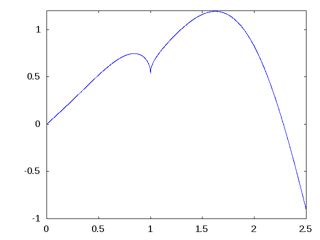
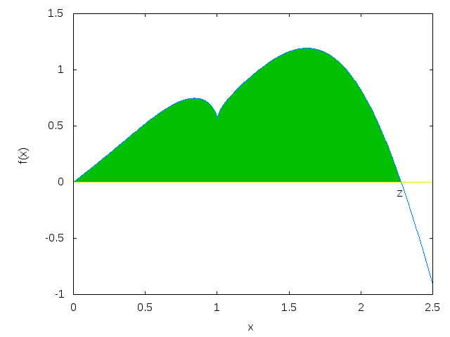

# Skrypty i funkcje

## Program, skrypt i funkcja

Warto rozróżnić trzy pojęcia, które w praktyce często są używane zamiennie, choć oznaczają coś trochę innego.

**Program** to ogólnie ciąg instrukcji prowadzących do wykonania określonego zadania. Program może być bardzo krótki albo składać się z wielu plików i funkcji.

**Skrypt** w Octave jest prostym programem zapisanym w pliku tekstowym, zwykle z rozszerzeniem `.m`. Zawiera kolejne polecenia Octave wykonywane od początku do końca w bieżącym obszarze roboczym. Można więc potraktować skrypt jako zapis sesji obliczeniowej, którą chcemy zachować, poprawiać i wielokrotnie uruchamiać.

**Funkcja** również zawiera kod, ale ma jasno określone argumenty wejściowe i wartości zwracane. Funkcję definiujemy po to, aby ten sam fragment obliczeń można było wielokrotnie wywoływać dla różnych danych. Funkcja ma własne zmienne lokalne i jest bardziej samodzielnym elementem programu niż skrypt.

Na początku najprościej zobaczyć różnicę na skrypcie. Zamiast wpisywać trzy polecenia bezpośrednio w konsoli:

```octave
1/7
2/7
3/7
```

możemy zapisać je w pliku `programik.m`:

```octave
% Prosty program testowy
1/7
2/7
3/7
```

Jeżeli plik `programik.m` znajduje się w bieżącym katalogu, uruchamiamy cały skrypt wpisując jego nazwę bez rozszerzenia:

```octave
programik
```

Wynik:

```text
ans = 0.14286
ans = 0.28571
ans = 0.42857
```

Octave wykonuje wtedy kolejno wszystkie instrukcje zapisane w pliku.

Najważniejsza zaleta skryptu polega na **trwałości i powtarzalności**. Kod można poprawiać przez wiele dni, uruchamiać ponownie dla nowych danych, przekazać innej osobie i wrócić do niego po dłuższym czasie. Nie jest już ulotną serią poleceń wpisanych jednorazowo w konsoli.

Aby Octave znalazł skrypt, plik musi znajdować się w bieżącym katalogu albo na ścieżce wyszukiwania. Bieżący katalog można sprawdzić i zmienić poleceniami `pwd` i `cd`.

## Komentarze i pomoc dla własnego kodu

Komentarze rozpoczynamy znakiem `%` lub `#`:

```octave
% To jest komentarz
a = 2 + 2;
```

Komentarze umieszczone na początku pliku mogą pełnić funkcję dokumentacji. Po wydaniu:

```octave
help programik
```

Octave może wyświetlić opis zapisany w komentarzach.

## Quiz ze skryptów

1. Co to jest skrypt?
2. Jakie rozszerzenie mają typowe pliki skryptowe Octave?
3. Jak uruchamia się skrypt znajdujący się w katalogu roboczym?
4. Jak sprawdzić bieżący katalog?
5. Jak umieszczać komentarze w kodzie?

## Zadania ze skryptów

**Zadanie 1.** Utwórz skrypt `wektor.m`. Zdefiniuj w nim dwuwymiarowy wektor, np.

   ```octave
   v = [3 4];
   ```

   Następnie oblicz jego długość ze wzoru $\sqrt{v_1^2+v_2^2}$ i porównaj wynik z wartością zwracaną przez `norm(v)`. Uruchom cały skrypt z konsoli.

**Zadanie 2.** Wpisz początek nazwy polecenia `sombrero`, np. `som`, i użyj `Tab`, aby sprawdzić autouzupełnianie.

**Zadanie 3.** Sprawdź dokumentację:

   ```octave
   help sombrero
   ```

**Zadanie 4.** Wywołaj `sombrero` z różnymi argumentami, np. `30` i `100`.

**Zadanie 5.** Sprawdź pełniejszą dokumentację poleceniem `doc sombrero`.

**Zadanie 6.** Sprawdź, czy wygenerowany wykres można obracać, przybliżać i oddalać.

**Zadanie 7.** Za pomocą `help sombrero` sprawdź, gdzie znajduje się definicja tej funkcji. Następnie utwórz własny plik `kolec.m`, który będzie rysował funkcję

   $
   z(x,y)=2^{-\sqrt{x^2+y^2}},
   \qquad -4\le x,y\le4.
   $

   Dodaj własny komentarz i sprawdź, czy pojawia się po wydaniu `help kolec`.

## Definiowanie funkcji

Funkcje użytkownika również zapisujemy w plikach `.m`. Załóżmy, że chcemy zdefiniować funkcję `sinusik`, która przybliża sinus wielomianem Taylora:

$$
\sin x\approx x-\frac{x^3}{6}+\frac{x^5}{120}.
$$

Na początek zdefiniujmy ją dla argumentu skalarnego. Plik `sinusik.m` może mieć postać:

```octave
function y = sinusik(x)
  y = x - x^3/6 + x^5/120;
end
```

Wywołanie:

```octave
sinusik(0.1)
```

zwraca wartość zbliżoną do $\sin(0.1)$.

### Podstawowe zasady

- plik powinien mieć nazwę odpowiadającą nazwie głównej funkcji,
- funkcja może przyjmować wiele argumentów,
- funkcja może zwracać jedną lub kilka wartości,
- instrukcje wewnątrz funkcji zwykle kończymy średnikiem,
- funkcja może korzystać z innych funkcji pomocniczych.

Przykład kilku argumentów:

```octave
function y = f(a, b, c)
  y = a + b + c;
end
```

Przykład kilku wartości zwracanych:

```octave
function [y, eps, xi] = f(a, b, c)
  % ...
end
```

Średnik na końcu instrukcji zapobiega wyświetlaniu jej wyniku. Podczas szukania błędów czasem celowo go pomijamy, aby zobaczyć wartości pośrednie.

## Odwzorowania i wektoryzacja

Jedną z najważniejszych własności Octave jest możliwość wykonywania wielu obliczeń **bez jawnego pisania pętli**.

Wiele funkcji działa element po elemencie na całych wektorach i macierzach. Przykładowo:

```octave
cos([0, 0.1, 0.2])
```

zwraca:

```text
1.00000   0.99500   0.98007
```

czyli:

$$
\cos([0,0.1,0.2])
=
[\cos 0,\cos 0.1,\cos 0.2].
$$

Funkcje takie jak `sin` czy `cos`, które potrafią działać element po elemencie na całych tablicach, są w dokumentacji Octave określane jako **mapping functions**. Nie jest to jednak to samo co **wektoryzacja**. Wektoryzacja oznacza sposób zapisu obliczeń na całych wektorach i macierzach bez jawnego wykonywania tej samej operacji w pętli. Funkcje typu *mapping* bardzo często ułatwiają więc wektoryzację, ale oba pojęcia nie są synonimami.

Przykład:

```octave
x = [0 0.1 0.2 0.3];
y = sin(x);
```

Nie każda operacja w Octave automatycznie działa w ten sposób. Szczególnie ważne jest odróżnienie **algebry macierzowej** od operacji wykonywanych **element po elemencie**.

## Dlaczego funkcja `sinusik` wymaga poprawki?

Nasza pierwsza wersja:

```octave
function y = sinusik(x)
  y = x - x^3/6 + x^5/120;
end
```

działa poprawnie dla liczby, ale wyrażenia `x^3` i `x^5` mają w Octave znaczenie **potęg macierzowych**, gdy `x` jest macierzą.

Dlatego funkcję przeznaczoną także dla wektorów i macierzy zapisujemy:

```octave
function y = sinusik(x)
  y = x - x.^3/6 + x.^5/120;
end
```

Teraz możemy wykonać:

```octave
sinusik([0 0.1 0.2 0.3])
```

i otrzymać cztery wartości naraz.

## Operatory „z kropką”

Kropka przed operatorem oznacza zwykle, że działanie ma zostać wykonane **element po elemencie**.

Najważniejsze pary operatorów są następujące:

| Operacja | Macierzowo | Element po elemencie |
| --- | --- | --- |
| mnożenie | `A * B` | `A .* B` |
| dzielenie prawostronne | `A / B` | `A ./ B` |
| dzielenie lewostronne | `A \ B` | `A .\ B` |
| potęgowanie | `A ^ B` | `A .^ B` |

Dodawanie i odejmowanie wykonuje się zwykłymi operatorami `+` i `-`; nie potrzebujemy dla nich osobnych wersji „z kropką”.

### Mnożenie: czyli różnica między `*` oraz `.*`

Dla macierzy:

```octave
m = [1 -1; -1 1];
v = [1 2; 3 4];
```

mnożenie element po elemencie:

```octave
m .* v
```

daje:

```text
   1  -2
  -3   4
```

Natomiast:

```octave
m * v
```

oznacza zwykłe mnożenie macierzowe i daje:

```text
  -2  -2
   2   2
```

Są to dwie zupełnie różne operacje.

### Dzielenie: `/`, `\`, `./`, `.\`

Dla liczb nie ma problemu:

```octave
6/3
3\6
```

dają ten sam wynik.

Dla macierzy `A/B` i `A\B` są jednak operacjami algebry liniowej. Intuicyjnie można je traktować jako rozwiązywanie odpowiednich równań macierzowych, bez jawnego obliczania macierzy odwrotnej.

Natomiast:

```octave
A ./ B
```

dzieli odpowiadające sobie elementy, a:

```octave
A .\ B
```

jest lewostronnym dzieleniem elementowym; elementowo odpowiada relacji `B ./ A`.

### Potęgowanie: `^` a `.^`

To rozróżnienie jest szczególnie ważne.

```octave
A^2
```

oznacza potęgę macierzową, czyli dla macierzy kwadratowej w praktyce $A A$.

Natomiast:

```octave
A.^2
```

podnosi **każdy element macierzy osobno** do kwadratu.

Przykład generujący kolejne potęgi liczby 2:

```octave
2.^(1:10)
```

daje:

```text
2   4   8   16   32   64   128   256   512   1024
```

Tutaj kropka jest niezbędna, ponieważ chcemy podnieść liczbę 2 kolejno do wszystkich potęg zapisanych w wektorze `1:10`.

### Kiedy kropka nie jest potrzebna?

Przy mnożeniu przez skalar:

```octave
A * 2
```

i:

```octave
A .* 2
```

dają ten sam wynik.

Podobnie:

```octave
A / 2
```

i:

```octave
A ./ 2
```

są równoważne.

Nie wolno jednak na tej podstawie zakładać, że kropkę można zawsze pomijać. Gdy oba argumenty są wektorami lub macierzami, różnica pomiędzy operacją macierzową i elementową staje się zasadnicza.

---

# Dokumentacja własnej funkcji

Komentarz umieszczony na początku pliku z funkcją może zostać wyświetlony przez `help`:

```octave
% Funkcja sinusik przybliża sin(x) wielomianem stopnia 5.
% Przybliżenie jest dobre dla małych |x|.

function y = sinusik(x)
  y = x - x.^3/6 + x.^5/120;
end
```

Po zapisaniu pliku jako `sinusik.m` warto sprawdzić:

```octave
help sinusik
```

## Pliki z funkcjami a skrypty

Zarówno skrypty, jak i funkcje zapisujemy w plikach `.m`, ale pełnią inną rolę:

- **skrypt** zawiera sekwencję instrukcji wykonywanych po kolei i działa w bieżącym obszarze roboczym,
- **funkcja** ma własną listę argumentów i wartości zwracanych oraz własny obszar zmiennych lokalnych.

W typowym pliku funkcyjnym pierwszą istotną instrukcją jest definicja funkcji.

W jednym pliku mogą znajdować się także funkcje pomocnicze wykorzystywane przez funkcję główną.

## Quiz z funkcji

1. Jak definiuje się argumenty funkcji?
2. Czy funkcja może zwracać kilka wartości?
3. Dlaczego instrukcje w funkcji często kończymy średnikiem?
4. Czym różni się skrypt od pliku zawierającego funkcję?
5. Jaka jest różnica między `A*B` i `A.*B`?
6. Dlaczego w `sinusik` używamy `x.^3`, a nie `x^3`?

## Zadania z definiowania funkcji

### **Zadanie 1**

Zdefiniuj funkcję

$$
f(x)=x\sqrt{|1-x|}\sin^2x+x\cos x.
$$

W Octave przydadzą się funkcje `sqrt` i `abs`. Funkcja powinna działać także dla wektora argumentów.

### **Zadanie 2**

Narysuj $f(x)$ dla $0\le x\le2.5$. Możesz zacząć od:

```octave
x = 0:0.001:2.5;
y = f(x);
plot(x, y);
```

Przykładowy wynik:

{ width="420" }

### **Zadanie 3**

Z wykresu oszacuj jedno z miejsc zerowych funkcji, a następnie wyznacz je numerycznie za pomocą `fzero`.

### **Zadanie 4**

Oblicz pole pomiędzy wykresem $f(x)$ a osią $x$ na odpowiednim przedziale, korzystając z numerycznego całkowania.

Na odzyskanym rysunku obszar całkowania zaznaczono kolorem:

{ width="420" }

### **Zadanie 5**

Sprawdź działanie następujących wyrażeń i wyjaśnij różnice:

```octave
A = [1 2; 3 4];
A*A
A.*A
A^2
A.^2
```