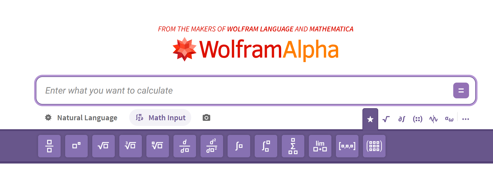
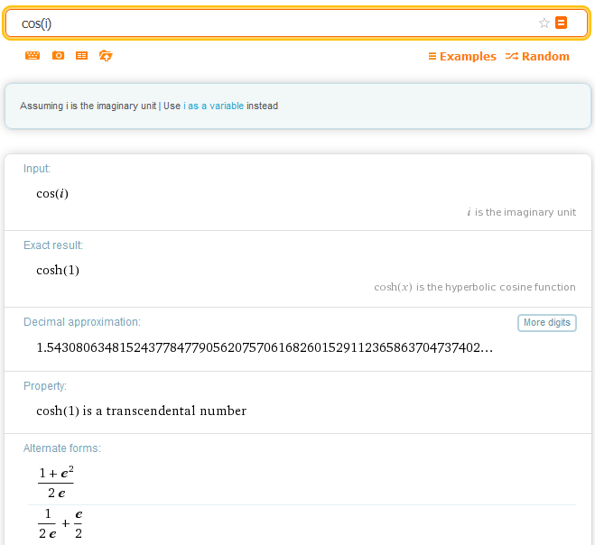
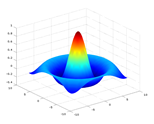

# Wolfram Alpha

{ width="800" }

**Wolfram Alpha** jest serwisem obliczeniowym, który zamiast zwracać listę stron internetowych próbuje bezpośrednio obliczyć lub zestawić odpowiedź na zadane pytanie. Można wpisywać zarówno wyrażenia matematyczne, jak i krótkie pytania lub hasła, np. `How far is the Moon now?`, `copper` albo `speed of light`.

Jedną z najważniejszych zalet Wolfram Alpha jest połączenie obliczeń symbolicznych, numerycznych i dużej bazy danych. Dzięki temu serwis jest przydatny zarówno do szybkiego sprawdzania rachunków, jak i do eksplorowania własności funkcji, stałych, jednostek, danych fizycznych czy astronomicznych.

Wolfram Alpha powstał w 2009 roku i jest rozwijany przez firmę Wolfram Research, znaną również z systemu **Mathematica** oraz języka **Wolfram Language**. W 2012 roku powstała również wersja mobilna Wolfram Alpha na systemy Android i iOS.

Choć współczesne modele językowe (**LLM**, *Large Language Models*) i wyszukiwarki internetowe potrafią odpowiadać na pytania w języku naturalnym, Wolfram Alpha pozostaje przydatnym narzędziem do szybkich obliczeń, sprawdzania własności funkcji i danych liczbowych, a także do uzyskiwania informacji z wielu baz danych.

## Dostęp do Wolfram Alpha

[Otwórz Wolfram Alpha](https://www.wolframalpha.com/){ .md-button .md-button--primary } oraz [Przykłady z fizyki](https://www.wolframalpha.com/examples/science-and-technology/physics){ .md-button .md-button--primary }

## Jak wpisywać zapytania?

Wolfram Alpha nie wymaga formułowania pełnych zdań. Często wystarcza krótka fraza, nazwa obiektu lub samo wyrażenie matematyczne. Sprawdź kilka przykładów:

```text
copper
```

```text
10 nearest stars
```

```text
population France / population Germany
```

```text
integrate sin(x)^2
```

W tym kursie zapytania do Wolfram Alpha wpisujemy w **języku angielskim**. Angielskie nazwy poleceń i pojęć matematycznych dają najbardziej przewidywalną interpretację zapytania i odpowiadają przykładom używanym na zajęciach.

## Przykład: `cos(i)`

Po wpisaniu

```text
cos(i)
```

Wolfram Alpha może przedstawić kilka równoważnych informacji o tym samym wyrażeniu.

{ width="700" } 

W szczególności:

- interpretuje $i$ jako jednostkę urojoną,
- podaje dokładną wartość

  $$
  \cos(i)=\cosh(1),
  $$

- podaje wartość numeryczną,
- wskazuje alternatywną postać

  $$
  \cos(i)=\frac{e+e^{-1}}{2},
  $$

- może podać wartość numeryczną z bardzo dużą liczbą cyfr,
- informuje o dodatkowych własnościach liczby, np. że $\cos(i)$ jest liczbą przestępną,
- może pokazać rozwinięcie w szereg:

  $
  \cos(i)=\cosh(1)
  =1+\frac{1}{2!}+\frac{1}{4!}+\frac{1}{6!}+\ldots,
  $

- może podać rozwinięcie w ułamek łańcuchowy i inne reprezentacje.

To dobry przykład tego, że jedno krótkie zapytanie może prowadzić równocześnie do wyniku dokładnego, przybliżenia numerycznego, szeregu, alternatywnych reprezentacji i odnośników do dalszej wiedzy.

## Do czego używać Wolfram Alpha?

W ramach tego kursu Wolfram Alpha najlepiej traktować jako narzędzie do:

- szybkiej kontroli rachunków,
- obliczeń symbolicznych,
- obliczeń numerycznych,
- rozwiązywania równań,
- obliczania granic, pochodnych, całek i sum,
- rysowania wykresów,
- sprawdzania jednostek i stałych fizycznych,
- wyszukiwania danych liczbowych i porównywania wielkości.

Wolfram Alpha nie zastępuje jednak języka programowania. Do dłuższych obliczeń, automatyzacji, pracy na tablicach danych i pisania własnych programów w tym kursie używamy przede wszystkim **GNU Octave**.

## Wolfram Alpha a Octave

Te narzędzia dobrze się uzupełniają, ale służą do nieco innych zadań:

| Wolfram Alpha | Octave |
| --- | --- |
| szybkie pojedyncze zapytania | skrypty i całe programy |
| bardzo wygodne obliczenia symboliczne | automatyzacja obliczeń numerycznych |
| szybkie sprawdzanie wyników | praca na dużych zbiorach danych |
| dane z wielu dziedzin i jednostki | własne algorytmy i procedury |
| działa głównie jako usługa internetowa | może działać lokalnie i bez dostępu do sieci |

Wolfram Alpha ma wersję podstawową oraz płatne plany Pro z dodatkowymi funkcjami, m.in. rozszerzonym czasem obliczeń i rozwiązaniami krok po kroku.

## Quiz

1. Czym różni się Wolfram Alpha od klasycznej wyszukiwarki internetowej?
2. Czy Wolfram Alpha nadaje się wyłącznie do wykonywania obliczeń matematycznych?
3. Czy zapytania muszą być pełnymi, poprawnymi gramatycznie zdaniami?
4. Jakie typy obliczeń matematycznych potrafi wykonywać Wolfram Alpha?
5. Jakie są ograniczenia Wolfram Alpha w porównaniu z językiem skryptowym takim jak Octave?
6. Co łączy Wolfram Alpha z ekosystemem Wolfram Research, systemem Mathematica i językiem Wolfram Language?
7. Czy Wolfram Alpha wymaga zawsze idealnie sformułowanego zapytania?
8. Jakiego rodzaju dodatkowe możliwości oferują płatne wersje Pro?

## Zadania A — dane i wiedza ogólna

1. Podaj wartość tysięcznej cyfry w rozwinięciu dziesiętnym liczby $\pi$.
2. Podaj aktualną odległość Księżyca od Ziemi.
3. Podaj częstotliwość występowania liter alfabetu w tekście w języku polskim.
4. Policz średnicę atomu krzemu w nanometrach.
5. Sprawdź pogodę w dniu swoich urodzin w swoim mieście.
6. Sprawdź, ile witaminy D jest w $1\,\mathrm{km}^3$ mleka.
7. Porównaj Polskę i Niemcy.
8. Porównaj jabłko i pomarańczę.
9. Porównaj Alberta Einsteina i Marię Skłodowską-Curie.
10. Sprawdź stosunek populacji Francji i Niemiec.
11. Jaki kolor odpowiada fali o długości $480\,\mathrm{nm}$?
12. Sprawdź, ile kalorii jest w 10 M&M’s i osobno w $0{,}5\,\mathrm{l}$ wódki.
13. Sprawdź odległość między swoim miastem a Turynem.
14. Sprawdź jednocześnie czas w Polsce i Chile.
15. Sprawdź efekt wpisania `10 nearest stars`.
16. Sprawdź efekt wpisania każdej z fraz: `Weimar Triangle`, `Sierpiński Triangle`, `5000 words in Polish`.
17. Wybierz jeden z [przykładów z fizyki](https://www.wolframalpha.com/examples/science-and-technology/physics/index.html) i pokaż go pozostałym studentom.

## Zadania B — matematyka

**1.** Uprość (*simplify*) iloraz

$$
\frac{x^3-1}{x-1}.
$$

**2.** Narysuj wykres funkcji

$$
\frac{\sin(x^2)}{x}.
$$

**3.** Narysuj wykres tej samej funkcji obejmujący przedział $10\le x\le20$.

**4.** Sprawdź, jak wyrazić $\sin(2\alpha)$ jako funkcję $\sin\alpha$ i $\cos\alpha$.

**5.** Oblicz sumę (*sum*) odwrotności kolejnych liczb naturalnych od 1 do 10000:

$$
1+\frac12+\frac13+\ldots+\frac{1}{10000}.
$$

**6.** Oblicz sumę odwrotności kwadratów wszystkich liczb naturalnych:

$$
1+\frac14+\frac19+\frac1{16}+\frac1{25}+\ldots
$$

**7.** Rozłóż na czynniki pierwsze (*factorize*) liczbę `1234567890`.

**8.** Rozwiń (*expand*) wyrażenie $(x+1)(x-2)$.

**9.** Znajdź postać iloczynową (*factor*) wyrażenia

$$
2-5x-3x^2.
$$

**10.** Na ile sposobów można wybrać (*choose*) 6 różnych liczb z 49?

**11.** Ile jest permutacji zbioru 15-elementowego? Wskazówka: użyj słowa `factorial` lub symbolu `!`.

**12.** Narysuj zbiór rozwiązań równania $x^2+y^2=1$.

**13.** Narysuj zbiór rozwiązań równania $x^2+y^3=1$.

**14.** Znajdź wszystkie asymptoty funkcji

 $$
 f(x)=\frac{x^2-1}{x^2-4}.
 $$

**15.** Znajdź wszystkie asymptoty funkcji

 $$
 f(x)=\frac{x^2-1}{x-2}.
 $$

**16.** Rozwiąż (*solve*) równanie $\sin x=\cos x$.

**17.** Rozwiąż równanie $\sin x=\cos(2x)$.

**18.** Rozwiąż równanie $\cos x=x/\pi$.

**19.** Narysuj wykres funkcji

 $$
 f(x,y)=\frac{\sin\left(\sqrt{x^2+y^2}\right)}{\sqrt{x^2+y^2}}.
 $$

 Na kolejnych zajęciach wygenerujesz analogiczny wykres w Octave poleceniem `sombrero`.

 
