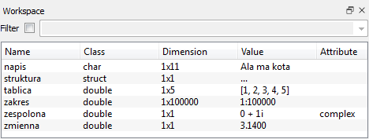

# Zmienne w Octave

Octave staje się szczególnie użyteczny wtedy, gdy zamiast pojedynczych rachunków zaczynamy przechowywać dane w zmiennych, wektorach i macierzach oraz przetwarzać je za pomocą skryptów.

## Definiowanie zmiennych

Zmienną definiujemy za pomocą operatora `=`:

```octave
a = 1
```

W kursie będziemy najczęściej używać:

- skalarów,
- wektorów,
- macierzy,
- zakresów,
- napisów.

Typ i rozmiar zmiennej można później sprawdzić m.in. poleceniami `class`, `size` i `whos`.

## Skalary

Skalar jest pojedynczą liczbą, np.:

```octave
a = 123;
b = -3.14;
c = 1.2e-10;
z = 1 + 3i;
```

Domyślnym typem liczbowym w typowych obliczeniach Octave jest liczba zmiennopozycyjna podwójnej precyzji (`double`).

Można to sprawdzić:

```octave
class(a)
```

Octave obsługuje również inne typy liczbowe, np. liczby całkowite o określonej liczbie bitów:

```octave
int8(9)
uint64(1)
single(1.5)
```


## Wektory

Wektor wierszowy można zapisać jako:

```octave
a = [1, 2, 3, 4]
```

Przecinki pomiędzy elementami można często pominąć:

```octave
a = [1 2 3 4]
```

Do elementów odwołujemy się przez indeks w nawiasach okrągłych:

```octave
a(2)
a(2) = 3;
```

Octave numeruje elementy od **1**, nie od 0.

Wektor można rozszerzać:

```octave
a = [a, 7, 10, 100];
a(10) = 10;
```

Jeżeli przypiszemy wartość elementowi znajdującemu się poza dotychczasowym końcem wektora, brakujące elementy zostaną wypełnione zerami.

Liczbę elementów zwraca funkcja:

```octave
length(a)
```

Wektor kolumnowy definiujemy za pomocą średników:

```octave
v = [1; 2; 5]
```

## Macierze

Macierz można zdefiniować, oddzielając elementy w wierszu przecinkami lub spacjami, a kolejne wiersze średnikami:

```octave
m = [1, 2; 3, 4]
```

Podstawowe informacje o rozmiarze macierzy otrzymujemy poleceniami:

```octave
rows(m)
columns(m)
size(m)
```

Dostęp do elementu w wierszu `w` i kolumnie `k` ma postać:

```octave
m(w, k)
```

Przykład:

```octave
m(1, 2)
```

Dla Octave skalar można traktować jako macierz $1\times1$, wektor wierszowy jako macierz $1\times n$, a wektor kolumnowy jako macierz $n\times1$.

Ta macierzowa organizacja danych jest jedną z najważniejszych cech Octave.

## Zakresy

Zakresy ułatwiają tworzenie ciągów arytmetycznych:

```octave
1:4
1:0.5:4.1
```

Pierwszy zapis odpowiada ciągowi:

```text
1  2  3  4
```

a drugi:

```text
1  1.5  2  2.5  3  3.5  4
```

Ogólna postać to:

```text
początek : krok : koniec
```

Jeżeli `krok` pominiemy, Octave przyjmuje krok równy 1.

Zakres nie jest jedynie wygodnym sposobem wpisania długiego wektora. Octave może przechowywać regularny ciąg opisany przez początek, krok i koniec w zwartej postaci, bez konieczności jawnego przechowywania każdego elementu. Dlatego zakresy są szczególnie wygodne przy pracy z długimi regularnymi ciągami.

Zakresy są szczególnie użyteczne przy:

- tworzeniu osi wykresów,
- indeksowaniu fragmentów wektorów i macierzy,
- generowaniu danych,
- wektoryzacji obliczeń.

Przykład wyboru fragmentu wektora:

```octave
a = [10 20 30 40 50];
a(2:4)
```

## Napisy

Napisy można zapisywać w cudzysłowie:

```octave
tekst = "ala ma kota";
```

W praktyce napisy są przydatne m.in. jako etykiety wykresów, nazwy plików i argumenty wielu funkcji.

## Transpozycja macierzy

Dla macierzy rzeczywistej operator `'` wykonuje transpozycję:

```octave
m = [1, 2, 3; 4, 5, 6];
b = m';
```

Wynikiem jest:

```text
b =
   1   4
   2   5
   3   6
```

Wektor wierszowy można więc łatwo zamienić na kolumnowy:

```octave
v = (1:4)';
```

Dla danych zespolonych operator `'` wykonuje **sprzężenie hermitowskie**, czyli transpozycję połączoną ze sprzężeniem zespolonym.

Zwykłą transpozycję bez sprzężenia zapisujemy jako `.'`:

```octave
m.'
```

To rozróżnienie jest ważne przy pracy z macierzami zespolonymi.

## Zapisywanie i wczytywanie danych

W bardziej rozbudowanych obliczeniach warto zapisywać wyniki pośrednie i końcowe do plików, aby można było później wrócić do pracy bez ponownego wykonywania wszystkich obliczeń.

Do zapisywania zmiennych służy polecenie `save`. W tym kursie będziemy korzystać przede wszystkim z binarnego formatu Octave:

```octave
a = [1, 2, 3, 4, 100];
save -binary "a.oct" a
```

Kilka zmiennych można zapisać jednocześnie:

```octave
save -binary "axm.oct" a x m
```

Jeżeli nie podamy nazw zmiennych, Octave może zapisać cały bieżący zestaw zmiennych:

```octave
save -binary "sesja.oct"
```

Dane wczytujemy poleceniem `load`:

```octave
load "axm.oct"
```

Polecenie `load` odtwarza zapisane zmienne wraz z ich nazwami.

Jeżeli chcemy obejrzeć dane w zwykłym edytorze tekstu, możemy zapisać je w formacie tekstowym:

```octave
save -text "a.txt" a
```

Octave obsługuje również inne formaty zapisu. Ich listę i składnię można sprawdzić poleceniem:

```octave
help save
```

## `who` i `whos`

Polecenie:

```octave
who
```

wyświetla nazwy aktualnie zdefiniowanych zmiennych.

Więcej informacji zwraca:

```octave
whos
```

Dla każdej zmiennej można w ten sposób sprawdzić m.in.:

- nazwę,
- rozmiar,
- liczbę zajmowanych bajtów,
- klasę danych.

To bardzo przydatne podczas pracy z dużymi macierzami.

## `clear`

Niepotrzebną zmienną można usunąć z pamięci:

```octave
clear z
```

Kilka zmiennych można usunąć jednocześnie:

```octave
clear a b c
```

Aby usunąć wszystkie zwykłe zmienne z bieżącego obszaru roboczego:

```octave
clear
```

## Octave GUI

W wersji graficznej szczególnie przydatne są panele:

- *File Browser* — pliki i katalog roboczy,
- *Workspace* — aktualnie zdefiniowane zmienne,
- *Command History* — historia wykonanych poleceń.

Panel *Workspace* pozwala szybko sprawdzić, jakie zmienne istnieją, jaki mają rozmiar i typ. Jest graficznym odpowiednikiem części informacji dostępnych przez `who` i `whos`.

{ width="600" }

*Przykład panelu Workspace w graficznej wersji Octave.*

## Quiz

**1.** Czym różnią się w Octave następujące zmienne?

```octave
a = 1
b = 1.0
c = 1e0
```

Czy mają tę samą wartość? Czy są reprezentowane w ten sam sposób?

**2.** Jak w Octave zapisuje się wektory wierszowe?

**3.** Jak w Octave zapisuje się wektory kolumnowe?

**4.** Czym różnią się następujące zmienne?

```octave
a = [1 2 3];
b = [1, 2, 3];
c = [1; 2; 3];
```

**5.** Jaki jest związek skalarów, wektorów wierszowych i wektorów kolumnowych z macierzami?

**6.** Co to są zakresy? Czym różnią się od jawnie zapisanych wektorów i dlaczego są wygodne?

**7.** Co to jest transpozycja macierzy? Jak oznacza się ją w Octave?

**8.** W jaki sposób można łatwo zamienić wektor kolumnowy w wierszowy i odwrotnie?

**9.** W jaki sposób zapisuje się zmienne Octave w zewnętrznych plikach?

**10.** W jaki sposób wczytuje się zmienne Octave z plików?

**11.** Jak zwolnić pamięć zajmowaną przez niepotrzebną zmienną?

**12.** Jak sprawdzić, jakie zmienne są aktualnie zdefiniowane, jaki mają rozmiar i ile pamięci zajmują?

## Zadania

**Zadanie 1.** Utwórz wektor `v` o elementach `1, 2, 5, 10` i zapisz go w binarnym pliku Octave:

```octave
v = [1 2 5 10];
save -binary "v.oct" v
```

**Zadanie 2.** Zamknij Octave, uruchom go ponownie i wczytaj zapisany plik:

```octave
load "v.oct"
```

Sprawdź poleceniem `who`, że zmienna `v` została odtworzona.

**Zadanie 3.** Dla wektora `v` sprawdź działanie:

```octave
v + v
v + 1
v * 2
v'
```

**Zadanie 4.** Utwórz wektor `a = 10:10:100`, a następnie za pomocą indeksowania zakresami wyświetl elementy od trzeciego do siódmego.

**Zadanie 5.** Pobierz przykładowy plik danych [equation.mat](../site_assets/equation.mat), a następnie:

1. wczytaj go do Octave,
2. sprawdź nowe zmienne poleceniem `who`,
3. zbadaj rozmiar zmiennej `X` za pomocą `size`, `columns` i `whos`,
4. wyznacz najmniejszą, największą, średnią i medianę elementów `X` za pomocą `min`, `max`, `mean` i `median`,
5. narysuj `X` poleceniem `plot(X)`,
6. zapisz `X` do pliku tekstowego poleceniem `save -text` i sprawdź jego zawartość.
